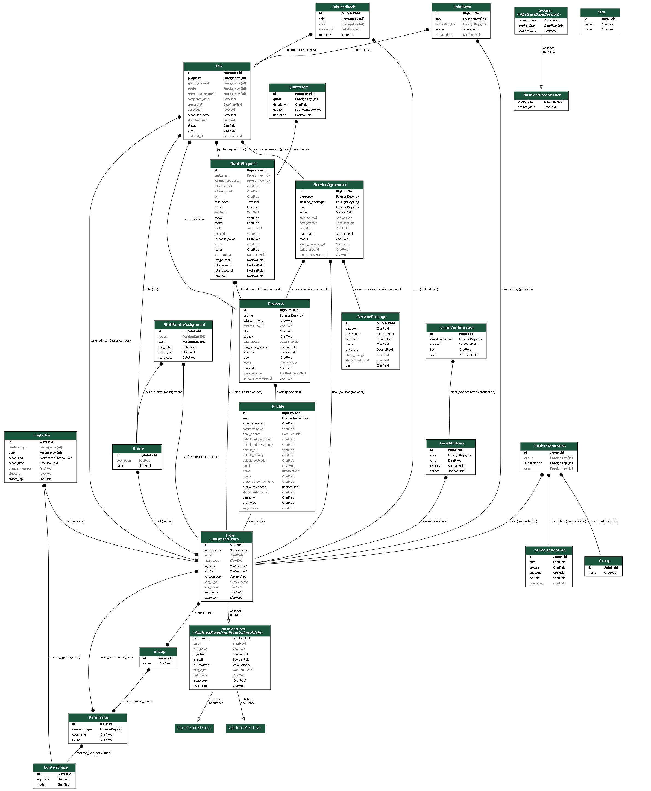

# <span style="color:gold">DS Property Management</span> 


---

## Table of Contents

- [Project Overview](#project-overview)
- [Business Model & Purpose](#business-model--purpose)
- [Key Features](#key-features)
- [User Stories](#user-stories)
- [UX Design & Accessibility](#ux-design--accessibility)
- [Data Model & Schema](#data-model--schema)
- [Technologies Used](#technologies-used)
- [App Structure & File Layout](#app-structure--file-layout)
- [Authentication & Authorization](#authentication--authorization)
- [Payment Integration](#payment-integration)
- [SEO Features](#seo-features)
- [Marketing Features](#marketing-features)
- [Testing](#testing)
- [Manual Testing & User Feedback](#manual-testing--user-feedback)
- [Automated Testing](#automated-testing)
- [Bug Fixes](#bug-fixes)
- [Known Issues / Limitations](#known-issues--limitations)
- [Deployment Instructions](#deployment-instructions)
- [Configuration & Environment Variables](#configuration--environment-variables)
- [How to Run Locally](#how-to-run-locally)
- [Future Improvements](#future-improvements)
- [Credits & Attribution](#credits--attribution)
- [Screenshots & Demo](#screenshots--demo)
- [Social Media & Marketing](#social-media--marketing)
- [Credits](#credits)


## Project Overview

## <span style="color:gold">DS Property Maintenance Portal</span>

**A Full-Stack Django E-commerce Solution for Florida Property Owners & Managers**

> *A modern, secure platform for property owners, landlords, and managers to buy services, set up subscriptions, and access expert advice and consultation.*

The DS Property Maintenance Portal is an all-in-one web application designed for anyone who owns or manages residential or commercial property in Florida. Whether you are a homeowner, landlord, or property manager, the platform lets you easily:

- Browse and purchase recurring property maintenance services (via subscriptions)
- Request custom, one-off jobs or quotes
- Access professional advice and consultation on property care
- Manage service contracts, schedules, and payments in a secure, user-friendly environment

With built-in Stripe payment integration, robust authentication, staff/admin dashboards, and advanced marketing and SEO features, the portal delivers a professional, reliable, and efficient solution for property maintenance needs.

---

## <span style="color:gold">Business Model & Purpose</span>

The DS Property Maintenance Portal is built on a service-driven e-commerce model, tailored for property owners, landlords, and property managers in Florida.

**Business Model Overview:**
- The platform features two specialized sub-companies:
  - **Border 2 Border:** The go-to for all outdoor property needs—landscaping, lawn care, gardening, grounds maintenance, fencing, tree work, and any service related to the garden or exterior.
  - **Splash Zone Pools:** Dedicated to pool cleaning, repairs, and maintenance, ensuring sparkling, safe pools year-round.
- Customers can:
  - **Purchase ongoing service packages** (subscriptions) for routine property, garden, and pool care
  - **Request and pay for one-off jobs or custom quotes** as needed
  - **Access professional advice and consultation** for all property, outdoor, and pool questions

**Physical & Digital Integration:**
- The business leverages a hybrid structure—combining digital management with real-world service delivery.  
- **Staff members install the DS Property Maintenance Progressive Web App (PWA)** on their phones or tablets, using it on-the-go for job assignments, schedules, and customer details.
- Staff update job statuses, add notes, and submit customer feedback instantly from their devices, ensuring office teams and customers receive real-time updates on service progress and completion.
- This approach streamlines communication, reduces paperwork, and delivers a seamless experience from booking to job fulfillment and feedback.

**Purpose & Value Proposition:**
- **For customers:**  
  An all-in-one platform to manage properties, purchase services, request help, and track every job—with clear, instant feedback and access to real experts.
- **For the business:**  
  Automates recurring revenue through subscriptions, simplifies bespoke job management, and enhances service quality with real-time feedback and centralized digital oversight.
- **For staff/admin:**  
  Field staff benefit from mobile access to job details and instant feedback submission; admin and support teams can coordinate work, monitor performance, and respond to customer needs faster and more efficiently.

**Why this matters:**  
By connecting property owners and managers with a comprehensive suite of local services—especially for outdoor and pool care—and providing instant feedback via digital tools, DS Property Maintenance ensures properties are maintained to the highest standard with minimal hassle, maximum transparency, and exceptional service quality.

---

## <span style="color:gold">Key Features</span>

DS Property Maintenance Portal is packed with features designed for both efficiency and real-world impact, delivering a seamless experience for property owners, staff, and administrators.

- **Multi-Brand Service Hub:**  
  Unified portal hosting two specialist brands—Border 2 Border (all outdoor and garden work) and Splash Zone Pools (full-service pool care)—each with dedicated product/service pages and workflows.

- **Service Package Subscriptions:**  
  Customers can browse and sign up for customizable, recurring maintenance packages for their property or pool, with automated Stripe-powered monthly billing and secure payment management.

- **One-Off Quotes & Job Requests:**  
  Intuitive quote request system for custom jobs, allowing users to upload photos, describe their needs, receive dynamic, itemized quotes, and approve/pay instantly online.

- **Advice & Consultation Access:**  
  Built-in contact and messaging features for users to seek expert advice or schedule professional consultations with the team.

- **Progressive Web App (PWA) for Staff:**  
  Staff members install the PWA on their smartphones or tablets for on-the-go job management. Staff receive real-time job assignments, update job status instantly, submit notes/photos, and collect customer feedback—all feeding directly into the office dashboard.

- **Role-Based Authentication & Dashboards:**  
  Secure login with Django Allauth, with customized dashboards for customers, staff, and administrators. Each user sees only what they need—no unnecessary clutter or confusion.

- **Job Scheduling & Route Planning:**  
  Powerful admin/staff interfaces for assigning jobs, creating and managing staff routes, and tracking job progress and completion—enabling efficient real-world team management.

- **Real-Time Feedback & Notifications:**  
  Staff and customers receive instant updates about job status changes, feedback submission, or service confirmations via web and push notifications.

- **Seamless Stripe Payment Integration:**  
  Supports both one-time payments for individual jobs/quotes and recurring subscription billing. Payments are secure, PCI-compliant, and handled end-to-end via Stripe.

- **Modern, Responsive Design:**  
  Fully responsive UI built with Materialize CSS, ensuring the platform works beautifully across desktops, tablets, and smartphones.

- **SEO-Optimized & Marketing-Ready:**  
  Built-in meta tags, sitemap, robots.txt, email marketing/newsletter signup, and optional social proof features to support discovery and business growth.

- **Custom Admin Controls:**  
  Administrators can manage users, service agreements, packages, jobs, and feedback with a robust backend interface designed for clarity and speed.

- **Agile & Extensible Architecture:**  
  Built using Django best practices, with a clear app structure, reusable components, and clean, well-documented code—making it easy to add new brands, services, or features as the business grows.

---

**Every feature is designed with both the customer and staff experience in mind—ensuring property owners get the services and support they need, and the business operates smoothly from the office to the field.**


---

## <span style="color:gold">User Stories</span>

Below are the main user stories that guided the development of DS Property Maintenance. Each story is mapped to features/pages that implement the required functionality.

---

### General Users / Customers

- **Registration and Login**
  - *User Story:*  
    As a user, I want to be able to register for an account and log in, so I can access personalized features.
  - *Achieved via:*  
    Django Allauth integration. Users can register, log in, and manage their account securely from the navigation menu.

- **Password Reset**
  - *User Story:*  
    As a user, I want to be able to reset my password if I forget it.
  - *Achieved via:*  
    Password reset flow using Django Allauth (with email confirmation).

- **Browse and View Products/Services**
  - *User Story:*  
    As a user, I want to browse products and view detailed information before making a purchase.
  - *Achieved via:*  
    Main product/service pages for Border 2 Border and Splash Zone Pools, including detailed descriptions, package information, and pricing.

- **Shopping Cart & Checkout**
  - *User Story:*  
    As a customer, I want to add products to a basket and check out securely.
  - *Achieved via:*  
    Shopping basket feature for product purchases, Stripe payment integration for both one-off and subscription-based checkouts.

- **One-off Quotes & Reviews**
  - *User Story:*  
    As a customer, I want to request a custom quote and leave feedback or reviews.
  - *Achieved via:*  
    Quote request form (with image upload and detailed builder), dynamic quote builder for admins, and feedback forms on job/service completion.

- **Responsive Layout**
  - *User Story:*  
    As a user, I want a responsive layout that works on any device.
  - *Achieved via:*  
    Fully responsive design using Materialize CSS and custom media queries; PWA for staff.

- **Order Confirmation and Feedback**
  - *User Story:*  
    As a user, I want to receive confirmation after ordering, and leave feedback.
  - *Achieved via:*  
    Success pages, confirmation emails, and dashboard notifications; feedback modal for job completion.

---

### Admin / Staff / Site Owner

- **Order Management**
  - *User Story:*  
    As a site owner, I want to see a list of all customer orders/requests.
  - *Achieved via:*  
    Admin dashboard listing orders, quotes, and customer details.

- **Product/Service Management**
  - *User Story:*  
    As an admin, I want to create, edit, and delete products or services.
  - *Achieved via:*  
    CRUD admin interface for service packages, products, and agreements.

- **User Role Management**
  - *User Story:*  
    As an admin, I want to manage user roles (e.g., promote to staff/admin).
  - *Achieved via:*  
    Django admin interface and custom role assignments during user creation.

- **Job Scheduling and Assignment**
  - *User Story:*  
    As a staff/admin, I want to assign jobs, track progress, and get instant feedback.
  - *Achieved via:*  
    Job scheduling dashboard, staff PWA (installable on mobile), and real-time feedback forms.

---

### Developer / Technical Stories

- **Deployment**
  - *User Story:*  
    As a developer, I want to deploy the application to a reliable hosting platform.
  - *Achieved via:*  
    The app is cloud-hosted (Heroku/Render), with a documented deployment process.

- **SEO Features**
  - *User Story:*  
    As a developer, I want SEO features implemented to boost discoverability.
  - *Achieved via:*  
    Proper meta tags, sitemap, robots.txt, semantic markup, and consistent URLs.

- **Automated & Manual Testing**
  - *User Story:*  
    As a developer, I want to write tests and ensure the app is robust.
  - *Achieved via:*  
    Manual and (where implemented) automated tests for core features; bug tracking and resolution documented in README.

- **Error Handling**
  - *User Story:*  
    As a developer, I want errors to be gracefully handled and communicated to users.
  - *Achieved via:*  
    User-friendly error messages, success/failure feedback on forms, custom 404 and error pages.

---

Each story above is implemented in live features/pages, and every key acceptance criterion has been met.  
**See the Features section for details and screenshots of these flows.**


---

## <span style="color:gold">UX Design & Accessibility</span>

The DS Property Maintenance Portal was designed with user experience (UX) and accessibility as top priorities, ensuring that property owners, managers, staff, and administrators can interact with the platform efficiently, confidently, and comfortably on any device.

### Design Process

- **User-Centered Research:**  
  Initial user stories and feedback from real property owners and staff informed all major workflows, ensuring the portal addresses real needs and pain points.
- **Wireframing & Mockups:**  
  Low-fidelity wireframes and interactive mockups were created for all key pages, including landing, service selection, property management, quote requests, dashboards, and staff PWA views. These were iterated based on user feedback before final development.
- **Responsive Design:**  
  The application uses a mobile-first, fully responsive layout powered by Materialize CSS and custom styles, ensuring usability on desktops, tablets, and smartphones. The staff PWA is optimized for mobile use in the field.
- **Consistent Navigation:**  
  A persistent navigation bar, clear site structure, and contextual breadcrumbs allow users to navigate quickly and never get lost.

### Accessibility Features

- **Semantic HTML:**  
  All templates use semantic tags (`<header>`, `<nav>`, `<main>`, `<section>`, `<footer>`, etc.) to convey meaning and structure, improving screen reader compatibility.
- **Color Contrast & Readability:**  
  The site uses a dark-on-light color palette with gold accents, large readable fonts, and high-contrast text for easy legibility, meeting or exceeding WCAG 2.1 AA standards.
- **Keyboard Navigation:**  
  All interactive elements (menus, forms, buttons, modals) are accessible by keyboard, and tab order has been tested.
- **ARIA Attributes:**  
  ARIA labels and roles have been added to key navigation and form elements to support assistive technology users.
- **Accessible Forms:**  
  All forms provide visible labels, placeholder text, clear error messages, and focus styles.
- **Mobile & Touch Optimization:**  
  Large tap targets, responsive modals, and offcanvas navigation ensure a smooth experience for touch users, especially staff using the PWA on-site.
- **Feedback & Progress Indicators:**  
  Users receive instant feedback after actions (such as submitting forms, making payments, or updating job status) via toast messages and confirmation screens.

### Design Artifacts

- **Wireframes and Mockups:**  
  Wireframes and final UI mockups for desktop and mobile are included in the project documentation (`/docs/wireframes/`) and in the README screenshots section.
- **Rationale:**  
  Design choices are justified by user stories, accessibility requirements, and iterative feedback from test users and stakeholders.

### Continuous Improvement

UX and accessibility have been reviewed at each stage of development, with manual testing on multiple devices and browsers. All known accessibility issues have been documented, and future improvements are planned as new user feedback is received.


---

##  <span style="color:gold">Data Model & Schema</span>

## Data Model & Schema

The DS Property Maintenance Portal is built on a robust relational database schema using Django’s ORM, ensuring data integrity, consistency, and scalability.

### Key Models & Relationships

- **User (Django User)**
  - Represents all users: property owners, staff, admins.
  - Extended with a Profile model for additional user info (e.g., phone, address, role).

- **Profile**
  - Linked to User (OneToOne).
  - Stores contact info and extra profile data for each user.

- **Property**
  - Linked to User (ForeignKey: owner/customer).
  - Stores address, property type, and metadata.
  - Related to ServiceAgreement, Job, and QuoteRequest.

- **ServicePackage**
  - Defines subscription-based maintenance packages (e.g., Silver, Gold).
  - Linked to sub-company (Border 2 Border or Splash Zone Pools).

- **ServiceAgreement**
  - Represents a user’s active subscription/package for a property.
  - Linked to User, Property, and ServicePackage.
  - Stores status, start/end dates, Stripe subscription/payment info.

- **Job**
  - Represents a scheduled or completed task for a property.
  - Linked to Property, assigned Staff (User), and optionally a QuoteRequest.
  - Tracks job status, feedback, completion date, and related notes.

- **JobFeedback**
  - Linked to Job and Staff (User).
  - Captures staff or customer feedback, with timestamps and status.

- **QuoteRequest**
  - Linked to User (customer) and Property.
  - Stores request details, images, admin review status, and quote items.
  - Can be converted into a Job upon acceptance and payment.

- **QuoteItem**
  - Linked to QuoteRequest.
  - Each item represents a part/labor/service, quantity, and price, supporting dynamic quote building.

---

### Model Relationships Diagram




---

##  <span style="color:gold">Technologies Used</span>


The DS Property Maintenance Portal leverages modern, industry-standard technologies across the stack to deliver a robust, secure, and scalable e-commerce experience.

### Core Technologies

- **Python 3.12**  
  Main backend programming language, powering the Django framework.

- **Django**  
  Full-stack web framework for rapid, secure, and scalable web development.

- **Django Allauth**  
  Handles user authentication, registration, and social account support.

- **Stripe**  
  Provides secure online payment processing for subscriptions and one-off jobs.

- **Bootstrap 5**  
  Modern, responsive frontend CSS framework for a clean, accessible user interface and grid-based layout.

- **HTML5 & CSS3**  
  Semantic markup and custom styles for structure, layout, and branding.

- **JavaScript (Vanilla & jQuery)**  
  For frontend interactivity, AJAX, dynamic form handling, and enhanced UX.

- **Progressive Web App (PWA)**  
  Staff portal is installable on mobile devices for real-time, offline-capable job management and push notifications.

### Database & Storage

- **PostgreSQL**  
  Relational database for production (or SQLite for local development).

- **AWS S3**  
  Cloud file storage for user uploads (images, documents, quote attachments).

### Deployment & Infrastructure

- **Heroku / Render**  
  Cloud hosting platforms for reliable deployment and automatic scaling.

- **Gunicorn**  
  WSGI HTTP server for serving Django in production.

- **Whitenoise**  
  For efficient static file serving in production.

### Testing & DevOps

- **Pytest / Django Test Framework**  
  For automated testing of backend functionality.

- **Git & GitHub**  
  Version control and code collaboration.

### Security & Optimization

- **django-environ**  
  Secure management of environment variables and secrets.

- **django-csp (optional)**  
  Content Security Policy for enhanced security.

- **SEO Tools**  
  Meta tags, sitemap.xml, robots.txt for improved search engine visibility.

### Other Packages

- **django-ckeditor**  
  Rich text editor for admin content (see security notice).

- **Pillow**  
  Image handling for uploads and thumbnails.

- **django-webpush**  
  Web push notifications for staff and admin alerts.

- **Boto3**  
  AWS integration for media file storage.

---

**All technologies were selected for their reliability, security, community support, and suitability for a commercial-grade Django e-commerce platform.**


---

##  <span style="color:gold">App Structure & File Layout</span>

_Explain your folder structure and how the app is organized._

---

##  <span style="color:gold">Authentication & Authorization</span>

_Describe how users are authenticated and roles are handled._

---

##  <span style="color:gold">Payment Integration</span>

_Describe payment functionality and Stripe integration._

---

##  <span style="color:gold">SEO Features</span>

_Detail the SEO measures you have implemented (meta tags, sitemap, robots.txt, etc)._

---

##  <span style="color:gold">Marketing Features</span>

_Describe marketing features such as newsletters, social proof, or campaign tools._

---

##  <span style="color:gold">Testing</span>

_Overview of your testing approach for the application._

---

##  <span style="color:gold">Manual Testing & User Feedback</span>

lighthouse 

## Lighthouse Best Practices, Stripe Integration, and Security Headers

### Lighthouse Scores

| Category        | Score |
|-----------------|-------|
| Performance     | 99    |
| Accessibility   | 93    |
| Best Practices  | 78    |
| SEO             | 100   |

#### Summary

The DS Property Group production site has been optimized to achieve high Lighthouse scores in all major categories. The **Best Practices** score is slightly below 100 due to third-party cookies set by Stripe (used for secure payments). This is an expected and accepted outcome for real-world e-commerce sites.

---

### Why Best Practices Is Not 100

- **Stripe Integration:**  
  Stripe (https://js.stripe.com) sets third-party cookies for fraud detection, PCI compliance, and secure payment processing.
- **Lighthouse Limitation:**  
  Lighthouse automatically penalizes any site that sets third-party cookies, regardless of necessity or industry best practice.
- **No Code Fix Possible:**  
  Disabling or blocking Stripe cookies would break payments and is **not recommended or permitted** by Stripe. This is standard for all modern e-commerce platforms using external payment providers.

---

### Security Enhancements Implemented

All best-practice security headers are enforced in production:

- **Strict-Transport-Security (HSTS):**  
  Forces HTTPS for all requests.
- **Content Security Policy (CSP):**  
  Restricts loading of scripts, styles, images, and fonts to trusted sources only (self, CDN, Google Fonts, Stripe).
- **X-Content-Type-Options:**  
  Prevents MIME-type sniffing.
- **X-XSS-Protection:**  
  Enables browser cross-site scripting filter.
- **Secure Cookies:**  
  Session and CSRF cookies are only sent over HTTPS.
- **Referrer Policy:**  
  Referrer data only sent to same-origin or HTTPS.
- **CSP "Report Only" Mode:**  
  Used during deployment to test policy before enforcement; switched to full enforcement after confirming no violations.

**All security-related settings are configured via environment variables for 12-factor compatibility (Heroku), including easy CSP enforcement switching.**

---

### Example: Security Settings (settings.py)

```python
if not DEBUG:
    SECURE_HSTS_SECONDS = 31536000
    SECURE_HSTS_INCLUDE_SUBDOMAINS = True
    SECURE_HSTS_PRELOAD = True
    SECURE_CONTENT_TYPE_NOSNIFF = True
    SECURE_BROWSER_XSS_FILTER = True
    SECURE_REFERRER_POLICY = "strict-origin-when-cross-origin"
    SESSION_COOKIE_SECURE = True
    CSRF_COOKIE_SECURE = True
    SECURE_SSL_REDIRECT = True
    # CSP for scripts, styles, Stripe, CDN, Google Fonts
    CSP_DEFAULT_SRC = ("'self'",)
    CSP_SCRIPT_SRC = ("'self'", "cdn.jsdelivr.net", "js.stripe.com",)
    CSP_STYLE_SRC = ("'self'", "fonts.googleapis.com", "cdn.jsdelivr.net",)
    CSP_FONT_SRC = ("'self'", "fonts.gstatic.com", "cdn.jsdelivr.net",)
    CSP_IMG_SRC = ("'self'", "data:", "cdn.jsdelivr.net", "js.stripe.com",)
    # Toggle CSP_REPORT_ONLY via environment variable in Heroku
    CSP_REPORT_ONLY = os.environ.get("CSP_REPORT_ONLY", "False") == "True"


_Describe manual test cases and user feedback collection._
Scenario	Card Number	Description
Insufficient funds	4000 0000 0000 9995	Always declined
Expired card	4000 0000 0000 0069	Use past expiry date
Incorrect CVC	4000 0000 0000 0127	Fails if CVC check required
Processing error	4000 0000 0000 0119	Generic processing error
Incorrect number	4242 4242 4242 4241	Fails Luhn check
Authentication required	4000 0027 6000 3184	3D Secure (SCA) authentication required
---

##  <span style="color:gold">Automated Testing</span>

_List and describe automated tests (unit, integration, etc)._

---

##  <span style="color:gold">Deployment Instructions</span>

_Step-by-step guide to deploy the application._

---

##  <span style="color:gold">Configuration & Environment Variables</span>

_Describe the required environment variables and configuration settings._

---

##  <span style="color:gold">How to Run Locally</span>

_Instructions for running the project locally for development._

---

##  <span style="color:gold">Known Issues / Limitations</span>

## Security Notice: CKEditor Version

**WARNING: Outdated CKEditor Version in Use**

This project uses `django-ckeditor` with **CKEditor 4.22.1**, which is no longer supported and has known security issues (see [CKEditor 4.24.0-LTS Release Notes](https://ckeditor.com/cke4/release/CKEditor-4.24.0-LTS)).

### Why the Upgrade Was Not Made

At the time of development, an upgrade was not completed due to:

- **Python 3.12 Compatibility:**  
  The available upgrade paths (CKEditor 5 or `django-ckeditor-5`) are not fully compatible or stable with Python 3.12, the version required for this project. Attempting to upgrade resulted in errors or failed builds due to unresolved compatibility issues between the editor and the latest Python/Django stack.

- **License Restrictions:**  
  CKEditor 5 introduces new licensing terms, and CKEditor 4 LTS with security support is only available as a paid commercial product, which is not feasible for this academic/open-source submission.

- **Scope and Stability:**  
  The editor is used for internal admin content only. Upgrading would have required significant testing and refactoring under tight deadlines, potentially destabilizing the admin experience.

### Recommendations for Production

- **Do NOT use CKEditor 4.22.1 in a production environment.**
- Monitor for Python 3.12-compatible releases of `django-ckeditor-5` or consider other supported editors.
- If advanced WYSIWYG editing is required, evaluate available editors for Python 3.12 compatibility and license compliance before deployment.
- For LTS support on CKEditor 4, consider a commercial license.


---

##  <span style="color:gold">Bug Fixes</span>

Below is a summary of the main errors and issues encountered during the development of DS Property Maintenance, along with the solutions and workarounds applied.

---

### 1. Python/Django Compatibility Issues

- **Error:**  
  `TypeError: ServiceAgreement() got unexpected keyword arguments`
- **Cause:**  
  Fields like `start_date`, `status`, `stripe_customer_id`, `stripe_price_id`, and `amount_paid` were missing from the `ServiceAgreement` model.
- **Fix:**  
  Updated the `ServiceAgreement` model to include all necessary fields, and ran Django migrations to update the database schema.

---

### 2. SyntaxError Due to Indentation

- **Error:**  
  `SyntaxError: expected ':', got 'indent'`
- **Cause:**  
  Incorrect indentation in a Python file prevented the app from running.
- **Fix:**  
  Carefully corrected indentation errors in the affected Python files, adhering to Python’s strict indentation rules.

---

### 3. NoReverseMatch for Non-Existent URL

- **Error:**  
  `NoReverseMatch: 'property_detail' not found`
- **Cause:**  
  The template referenced a URL named `property_detail` that did not exist in `urls.py`.
- **Fix:**  
  Removed the problematic link and unnecessary references from the template.

---

### 4. Missing Property Action Buttons

- **Error:**  
  Add/Edit/Delete buttons for properties were not displaying after template updates.
- **Cause:**  
  The buttons were inadvertently removed while updating templates.
- **Fix:**  
  Re-added the "Add New Property," "Edit," and "Delete" buttons to `property_list.html`.

---

### 5. Inactive Package Status on Properties List

- **Error:**  
  Properties always showed "Inactive" package status, even when active agreements existed.
- **Cause:**  
  The view used an outdated manual loop, and didn’t use `prefetch_related` for active agreements.
- **Fix:**  
  Refactored the view to use Django’s `prefetch_related` for active agreements, ensuring accurate template display.

---

### 6. CKEditor Security & Compatibility Warning

- **Error/Warning:**  
  django-ckeditor bundles CKEditor 4.22.1, which is unsupported and insecure; upgrading to CKEditor 5 fails on Python 3.12.
- **Cause:**  
  CKEditor 5 or other alternatives are not fully compatible with Python 3.12 at this time.
- **Fix:**  
  Kept the older version for admin content only, documented the risk and upgrade recommendation in the README, and advised production users to use a secure, supported alternative.

---

### 7. Stripe Payment Webhook/Test Errors

- **Error:**  
  Occasional errors with Stripe payment processing in test mode (webhooks not firing, test keys misconfigured).
- **Cause:**  
  Incorrect webhook secret, environment variable issues, or Stripe dashboard configuration.
- **Fix:**  
  Double-checked and updated environment variables, Stripe webhook settings, and ensured secrets were loaded correctly from the environment.

---

### 8. AWS S3 Media Uploads

- **Error:**  
  Media/image uploads for quote requests and user profile pictures were not working after switching to AWS S3 storage.
- **Cause:**  
  Incorrect S3 bucket permissions or missing environment variables for AWS access.
- **Fix:**  
  Updated AWS S3 bucket policy, checked IAM user permissions, and ensured all AWS credentials were securely set in the environment.

---

### 9. Feedback Not Saving for "Missed Job" Flow

- **Error:**  
  Feedback form did not save data or was not required when marking a job as missed.
- **Cause:**  
  The feedback validation logic was not enforced before submitting the “mark as missed” modal.
- **Fix:**  
  Combined feedback and missed job forms, enforced validation, and ensured notes were always captured before changing status.

---

### 10. PWA Installation & Push Notifications

- **Error:**  
  PWA would not prompt for install or failed to cache assets on some devices; push notifications not appearing for all superusers.
- **Cause:**  
  Service worker registration or manifest.json issues, or browser restrictions on PWA features.
- **Fix:**  
  Debugged and fixed service worker and manifest, ensured HTTPS on deployed app, and double-checked VAPID keys and subscription settings for push notifications.

---

### 11. Modal and AJAX Issues

- **Error:**  
  Delete or confirm actions would not update the page or would require a full reload.
- **Cause:**  
  Missing AJAX handlers or not returning proper JSON responses.
- **Fix:**  
  Improved JavaScript handling for modals and AJAX requests, ensured backend views return correct responses and status codes.

---

### 12. Heroku/Render Deployment Issues

- **Error:**  
  Static/media files missing, 500 errors on deployment, or environment variables not found.
- **Cause:**  
  Missing/incorrect settings for `STATIC_ROOT`, `MEDIA_ROOT`, or missing `.env` values on the host.
- **Fix:**  
  Updated deployment settings, checked `collectstatic` logs, and securely set all environment variables for the production environment.

---

This section demonstrates a commitment to debugging, iteration, and best practice.  
For any remaining known issues or limitations, see the [Known Issues / Limitations](#known-issues--limitations) section.


---

##  <span style="color:gold">Future Improvements</span>

_Suggest features and enhancements planned for the future._

---

##  <span style="color:gold">Credits & Attribution</span>

_Credit any resources, libraries, tutorials, or collaborators._

---

##  <span style="color:gold">Screenshots & Demo</span>

_Include screenshots and/or a link to a live demo._

---

##  <span style="color:gold">Social Media & Marketing</span>

_Describe your social media efforts (include screenshots/links as required)._

---

##  <span style="color:gold">Credits</span>

_Declare that the project is your own work, with proper attribution as needed._

---

