<h1>
  <a href="https://ds-property-group-04ec2ca20d25.herokuapp.com/" style="color:gold; text-decoration: none;">
    DS Property Management  (click to view)
  </a>
</h1>


---

## Prerequisites & Viewing Notes

<ul>
  <li>
    This <strong>README</strong> is designed for
    <span style="color:gold; font-weight:bold;">dark mode</span> or
    <span style="color:#fff;">black backgrounds</span> for optimal readability,
    especially for gold and white text.
  </li>
  <li>
    <span style="color:gold; font-weight:bold;">Gold-highlighted headings</span>
    and certain images may appear less readable on a white or light background.
  </li>
  <li>
    For best results, use a Markdown viewer, code editor, or
    <a href="https://github.com/" style="color:gold; text-decoration:underline;">
      GitHub dark theme
    </a>.
  </li>
  <li>
    Some screenshots, UI mockups, and wireframes are shown for a
    <span style="color:gold; font-weight:bold;">dark-themed interface</span>.
  </li>
  <li>
    If any color/contrast issues are seen, please try switching to dark mode or a
    compatible Markdown app, such as
    <a href="https://code.visualstudio.com/" style="color:gold; text-decoration:underline;">
      VS Code
    </a> or
    <a href="https://typora.io/" style="color:gold; text-decoration:underline;">
      Typora
    </a>.
  </li>
</ul>

<p>
  <em>
    <strong>Note:</strong> HTML elements and custom styles are used in this README.
    Please view it on a platform that supports inline HTML, such as
    <a href="https://github.com/" style="color:gold; text-decoration:underline;">GitHub</a>,
    GitLab, VS Code, or Typora. If viewing in a restrictive Markdown viewer,
    some colors or styles may not render as intended.
  </em>
</p>

---

## Table of Contents

- [Project Overview](#project-overview)
- [Social Media Post for Facebook (Mockup)](#social-media-post-for-facebook-mockup)
- [Business Model & Purpose](#business-model--purpose)
- [Key Features](#key-features)
- [User Stories](#user-stories)
- [UX Design & Accessibility](#ux-design--accessibility)
- [Data Model & Schema](#data-model--schema)
- [Technologies Used](#technologies-used)
- [App Structure & File Layout](#app-structure--file-layout)
- [Authentication & Authorization](#authentication--authorization)
- [Payment Integration](#payment-integration)
- [SEO Features](#seo-features)
- [Marketing Features](#marketing-features)
- [Testing](#testing)
- [Manual Testing & User Feedback](#manual-testing--user-feedback)
- [Automated Testing](#automated-testing)
- [Bug Fixes](#bug-fixes)
- [Known Issues / Limitations](#known-issues--limitations)
- [Deployment Instructions](#deployment-instructions)
- [Configuration & Environment Variables](#configuration--environment-variables)
- [How to Run Locally](#how-to-run-locally)
- [GDPR Compliance & Staff Training](#gdpr-compliance--staff-training)
- [Future Improvements](#future-improvements)
- [Credits & Attribution](#credits--attribution)
- [Screenshots & Demo](#screenshots--demo)
- [Social Media & Marketing](#social-media--marketing)
- [Credits](#credits)

---

## Project Overview

### <span style="color:gold">DS Property Maintenance Portal</span>

**The Ultimate Full-Stack Django E-commerce Solution for Florida Property Owners & Managers**

Welcome to the next generation of property management!  
**DS Property Maintenance Portal** is more than a website—it’s a dynamic digital hub designed to _empower_ property owners, landlords, and managers throughout Florida.  
Whether you manage a single-family home, multiple rentals, or HOA communities, this platform delivers a streamlined, secure, and intuitive experience for every kind of user.

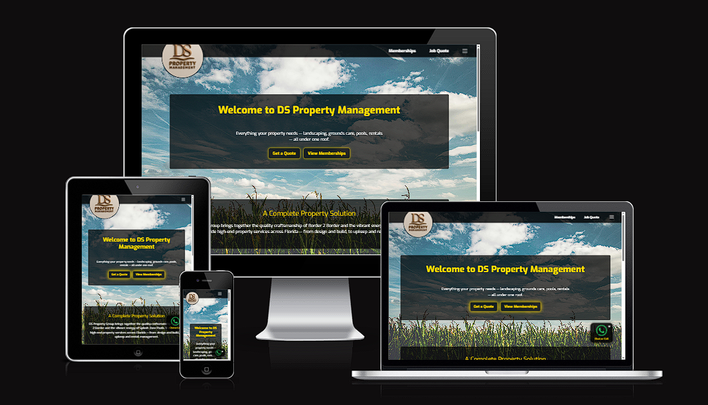

---

### Why Choose the DS Property Maintenance Portal?

- **Modern, Mobile-First Experience**  
  Designed from the ground up for mobile, tablet, and desktop, this portal ensures a _seamless_, beautiful user experience wherever you are—on site, at home, or on the go. Every feature and flow is engineered for speed, clarity, and delight, putting powerful tools right at your fingertips.

- **Lightning-Fast Navigation & Real-Time Interactions**  
  Instant page loads, dynamic content updates, toast notifications, and smooth transitions mean you’re always in control—no waiting, no confusion, just effortless results.

---

### Portal Features: Built for Real Needs

- **Browse & Buy Recurring Services (Subscriptions)**  
  Effortlessly explore a suite of property maintenance plans tailored for Florida’s unique environment. With a few taps, set up flexible, monthly service subscriptions (from pool cleaning to lawn care and beyond). **Never worry about missed maintenance again!** Stripe integration ensures _secure, hassle-free payments_, while automated scheduling keeps your property in top shape year-round.

- **Request Custom Jobs & Instant Quotes—With Photos!**  
  Need something outside a standard plan? No problem! Submit one-off job requests or ask for custom quotes in seconds. Upload photos of your property or issue, describe the task, and get fast, professional feedback. Every request is tracked in your dashboard, ensuring nothing is lost or overlooked.

- **Secure, User-Centric Account Management**  
  From day one, user privacy and security are built in. Manage your service contracts, payment details, and schedules all from one secure dashboard. Role-based access means owners, staff, and managers see only what they need—no clutter, no confusion.

- **Powerful Service & Payment Scheduling**  
  Visualize all your contracts and upcoming services in a _clean, calendar-driven interface_. Receive reminders, track past work, and reschedule as needed—all with a couple of clicks.

- **Visual Communication: See and Be Seen**  
  Attach photos, notes, or files to your jobs, making communication between customer and service provider crystal clear. No more guesswork—just transparency and efficiency.

- **Concierge-Level Support & Guidance**  
  Have questions? Access expert advice and fast, personalized support, directly through the portal. Our team is just a click away, ready to help you solve problems, optimize service, or choose the perfect package.

- **Accessibility for Everyone**  
  No user left behind! From high-contrast themes to ARIA labels, keyboard navigation, and mobile-friendly controls, the portal is designed for _universal access_. Enjoy a site that’s as usable for seniors as it is for savvy property pros.

---

### How DS Property Maintenance Portal Stands Out

- **Blazing fast, intuitive interface:** Modern web tech for a “just works” feel.
- **Rock-solid security:** HTTPS everywhere, Stripe payments, and secure user roles.
- **Seamless communication:** From booking to billing to completion—always in sync.
- **Full visibility:** Every job, payment, and service is at your fingertips, anytime.
- **Professional design:** Beautiful, branded layouts that _build trust_ and wow your customers.
- **Accessible to all:** Meets and exceeds accessibility standards for a truly inclusive web.

---

> **DS Property Maintenance Portal isn’t just a tool.  
> It’s your partner in property success.  
> Welcome to the future of Florida property management!**

---

### <span style="color:gold">Social Media Post for Facebook (Mockup)</span>

---

## Facebook Launch Announcement – Project Requirements & Explanation

The **Facebook post image** serves as a public launch announcement for the new DS Property Group website, designed to reach potential and current customers on social media with a clear, engaging message. It highlights key new features—including easy online booking, instant quotes, a unified dashboard, real-time job tracking, secure payments, and a mobile-friendly design—making property management accessible and transparent. The post uses branded visuals, clear call-to-actions (“Like & Follow”), and concise language, aligning with modern digital marketing standards for e-commerce service launches.

### Relevant Features Advertised

- **Demonstrate awareness of e-commerce fundamentals:**  
  Promote the online booking, payments, and user dashboard features.

- **Showcase marketing techniques:**  
  Use visual branding, emoji, and call-to-action to encourage engagement.

- **Highlight UX enhancements:**  
  Mention real-time updates, mobile compatibility, and ease of use.

- **Promote the secure payment system:**  
  Reference the integration of Stripe for secure payments.

- **Be suitable for professional platforms:**  
  Ensure text is clear, free from typos, and formatted for social media.

- **Reflect company branding and professionalism:**  
  Display the DS Property Group name, mission, and maintain visual consistency.

## 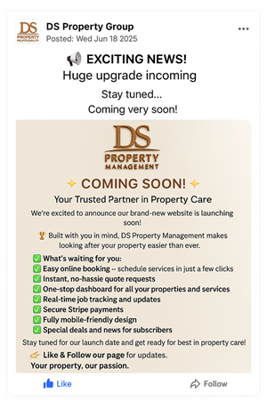

### <span style="color:gold">Business Model & Purpose</span>

**DS Property Maintenance Portal** is built on a flexible, future-ready business model that bridges digital convenience with hands-on expertise.  
The platform unites two specialist brands under one digital roof, giving Florida property owners a single, powerful portal for every outdoor and pool need.

---

### **Two Specialist Sub-Companies—One Seamless Experience**

- **🌳 Border 2 Border:**  
  The landscaping, gardening, fencing, and tree care experts.  
  Customers enjoy premium grounds maintenance, professional landscaping design, tree work, fencing, and more.  
  Every outdoor job is handled with the highest level of skill and reliability.

- **💧 Splash Zone Pools:**  
  The go-to team for pool cleaning, pool repair, and ongoing maintenance.  
  Customers get sparkling clean pools, rapid repairs, and long-term care packages—without ever having to worry about upkeep.

---

### **Customer Empowerment at Every Step**

With DS Property Maintenance Portal, customers aren’t just booking services—they’re in control of their property’s long-term health and value:

- **Purchase Ongoing Maintenance Packages (Subscriptions):**  
  Set-and-forget property care! Choose the right service plan, pay monthly with Stripe, and relax knowing every detail is handled.

- **Request & Pay for One-Off Jobs or Custom Quotes:**  
  Have a unique need or a big project? Instantly request quotes or book a single job—no long-term commitment required. Upload photos, describe your needs, and get a transparent, fair quote fast.

- **Access Professional Advice & Consultation:**  
  Not sure what’s needed? Get expert guidance and support direct from the pros, ensuring every property challenge is solved the right way.

---

### **Hybrid Model: The Best of Digital and Real-World Service**

DS Property Maintenance Portal blends the best of both worlds:

- **Digital Management:**  
  All scheduling, quotes, payments, and contract management are handled online through a user-friendly dashboard and mobile interface.

- **Real-World Service Delivery:**  
  Skilled staff perform work on-site across Florida, maintaining the highest professional standards.

- **Staff-First Technology:**  
   DS Property Maintenance Portal goes beyond traditional business models by investing in **cutting-edge technology for service staff**.  
  Our custom Progressive Web App (PWA), optimized for phones and tablets, transforms how property services are delivered in the field.

**Key Features for Field Teams:**

- **Dynamic Job Management:**  
  Staff log in each day to instantly see their assigned jobs and optimized route, complete with maps, time slots, and all the critical details for the day ahead.

- **Live Access to Property Notes:**  
  No more outdated paperwork or missed messages!

  - _Just-in-time information_: When a staff member checks in to start a job, they can see the latest property notes—only for the current job.
  - Need to open a garage, access a garden, or enter a gated community?
    - **Customers simply update their property notes or access codes online, and staff see the update in real time, only when and where it’s needed.**
  - All sensitive information is secured and visible only to staff actively working on that property, protecting both privacy and operational security.

- **Instant Feedback & Status Updates:**

  - Staff can leave job feedback, record materials used, report issues, and upload before/after photos—_all from their mobile device, on site_.
  - Managers see feedback instantly in their dashboard, enabling fast follow-up, high accountability, and top-notch service.

- **Real-Time Communication:**

  - Secure messaging tools allow staff and management to communicate quickly about specific jobs, scheduling changes, or customer needs—no phone tag or lost emails.

- **Easy Job Completion:**

  - Jobs are marked as complete via the app, automatically updating customer dashboards and triggering follow-up workflows (like satisfaction surveys or the next scheduled visit).

- **Security & Efficiency:**
  - Staff PWA access is role-based and time-limited, ensuring sensitive information (like gate codes) is _never_ left exposed.
  - All actions are logged for accountability, and access is removed when the job is marked done or after shift ends.

---

**This powerful, field-first technology ensures:**

- **Customers** can trust that the right information reaches the right staff at the right time—no confusion, no security risks, and no delay.
- **Staff** enjoy a modern, efficient, stress-free work experience, letting them focus on service—not paperwork.
- **Managers** gain live insight into team progress, instant feedback, and a complete digital record of every job.

**It’s a smarter, safer, and more responsive way to deliver property maintenance in the real world.**

This hybrid approach guarantees **maximum convenience and transparency for customers**, and **maximum efficiency and accountability for staff**.

---

**The result: A truly modern property services business—where digital speed and transparency meet real-world expertise and care.**

---

## <span style="color:gold">Key Features</span>

The DS Property Maintenance Portal is packed with innovative, industry-leading features—each one designed to deliver a smoother, smarter, and more secure property management experience for both customers and staff.

---

- **Multi-Brand Portal (Border 2 Border + Splash Zone Pools)**  
  One powerful login, two trusted specialist brands: users can seamlessly manage all their outdoor, landscaping, and pool needs from a single dashboard. Switching between services is fast and intuitive—no extra accounts, no confusion.

- **Recurring Service Package Subscriptions (Stripe-Powered)**  
  Say goodbye to tedious paperwork! Customers can set up monthly or seasonal service plans for lawns, gardens, or pools in seconds. Stripe integration means _secure, automated billing_—no missed payments, no interruptions.

- **Dynamic, Itemized One-Off Quotes with Image Upload**  
  Customers can request custom, one-time jobs by snapping and uploading photos directly through the portal. Quotes are built dynamically with itemized pricing, transparent tax calculations, and instant status updates at every stage.

- **Role-Based Dashboards (Customer, Staff, Admin)**  
  Every user gets a personalized dashboard with the tools and information they need—nothing more, nothing less.

  - **Customers:** See upcoming jobs, track payments, and request support.
  - **Staff:** Access assigned routes, property notes, and submit job feedback.
  - **Admins:** Oversee all jobs, monitor staff, manage users, and keep operations running smoothly.

- **Admin Tools for Job Assignment, Scheduling, and Feedback**  
  Administrators can quickly assign jobs to staff, adjust schedules, monitor progress in real time, and review detailed feedback. The entire operation is visible, manageable, and trackable at every moment.

- **PWA for Staff (Mobile Job Management, Push Notifications)**  
  Staff enjoy a blazing-fast Progressive Web App on their smartphones and tablets:

  - View job lists and routes
  - Receive instant push notifications for new or changed jobs
  - Access up-to-date property notes (like gate codes or access instructions) only when needed
  - Complete jobs and upload photos right from the field

- **Secure Authentication (Django Allauth)**  
  Built with robust authentication and security best practices—passwords are protected, sessions are secure, and user identity is verified at every step.

- **Robust Permission Controls**  
  Every action is permission-checked: only authorized users can see, edit, or manage sensitive data. Role-based access keeps your information safe and private.

- **SEO-Optimized Structure**  
  The portal’s pages and content are crafted with SEO best practices, ensuring customers (and search engines) can easily find and understand your services.

  - Semantic HTML
  - Meta tags for social sharing
  - Fast, accessible, mobile-first design

- **Secure, PCI-Compliant Stripe Payments**  
  All transactions are processed using Stripe—an industry leader for payment security.

  - PCI DSS compliance
  - Encrypted payments
  - No sensitive card data ever stored on your servers

- **Real-Time Feedback and Updates for Customers**  
  Customers are always in the loop:
  - Get instant notifications on job status, quotes, payments, and more
  - Toast messages and confirmations for every action
  - Live support and feedback at every stage of the customer journey

---

Each of these features has been meticulously crafted to deliver _maximum convenience, transparency, and peace of mind_ for every user—making DS Property Maintenance Portal the gold standard for digital property management in Florida.

---

## <span style="color:gold">User Stories</span>

### Customers

- Register/login and reset password (Django Allauth)
- As a user, I want to be able to browse packages, so that I can easily find ones that fit my requirements.
- Request/view custom quotes, leave feedback
- Responsive design across all devices

### Staff/Admin

- Dashboard for all jobs/requests/quotes
- CRUD for services, packages, agreements
- Assign jobs, view feedback, mark as complete/missed

### Developer

- Cloud deployment
- Automated/manual testing
- Error handling and robust security

**To view the full list of current and completed user stories, please visit the live project board:**  
[https://github.com/users/Rick-8/projects/14/views/1](https://github.com/users/Rick-8/projects/14/views/1)

---

### <span style="color:gold">UX Design & Accessibility</span>

### Mobile-First Responsive Design

- **Framework**: The site uses Bootstrap 5 grid and utility classes for a responsive layout, ensuring consistent rendering on all screen sizes, from mobile to desktop.
- **Custom Styles**: Additional custom CSS (`style.css`) supplements Bootstrap for brand-specific colors (notably gold and dark backgrounds), modern spacing, and component styling, keeping the look professional and unique.

### Consistent Navigation (Header/Footer)

- The navigation bar (header) is fixed and adapts to all device widths, using Bootstrap’s navbar classes and a custom offcanvas sidebar menu for mobile users.
- Footer is always visible, providing essential links (Contact, Privacy Policy, Cookie Policy) and social presence, reinforcing user confidence.
- Both header and footer are included on every page for familiarity and ease of access, reducing user cognitive load.

### Semantic HTML for Screen Reader Support

- HTML5 semantic tags are used throughout: `<header>`, `<nav>`, `<main>`, `<footer>`, `<section>`, `<form>`, and `<article>` where relevant.
- Page headings use appropriate hierarchy (`<h1>` for page title, `<h2>` for sections, etc.), aiding assistive technologies in page structure recognition.

### High Color Contrast and Readable Fonts

- Colors (gold, white, dark backgrounds) were selected and tested to provide high contrast.
- **Font choices** (Exo, Playfair Display, Fjalla One) are web-safe, modern, and tested for clarity and readability.
- Font sizes are responsive and large enough for comfortable reading on all devices.

### ARIA Labels and Roles

- All key interactive elements (offcanvas menu button, modals, close buttons, navigation links) have appropriate `aria-label`, `aria-controls`, and/or `role` attributes.
- Offcanvas navigation is accessible to screen readers and can be opened/closed via keyboard or assistive tech.
- Custom controls such as toast notifications and close buttons include descriptive ARIA attributes for clarity.

### Form Accessibility

All forms (login, signup, quote request, profile edit, etc.):

- Use visible, descriptive labels (`<label for="...">`) and placeholder text.
- Field errors are displayed immediately with accessible markup (`role="alert"` or `.invalid-feedback`), so users are aware of problems in real-time.
- Inputs are grouped semantically with `<fieldset>` and `<legend>` where appropriate for multi-part forms.
- All required fields are marked clearly, and validation messages are explicit and visible.

### Keyboard Accessibility

- Tab order has been tested: navigation links, offcanvas menus, and form elements are reachable via keyboard alone.
- Offcanvas navigation and modals can be opened and closed with keyboard shortcuts (ESC, TAB, ENTER).
- Focus indicators are visible and high-contrast.

### Touch Optimization

- All interactive elements (nav links, buttons, form inputs) have large enough hit areas for finger tapping (at least 44x44px where feasible).
- The offcanvas navigation is optimized for swiping/tapping on mobile, providing a smooth, modern user experience.
- No small or closely spaced buttons that would cause accessibility/touch issues.

### Real-Time Feedback

- The system uses toast notifications (visually and programmatically announced) for real-time status and error feedback (e.g., form submissions, logins, actions).
- Confirmations for critical actions (logout, job submission, subscription payment) are always shown, with clear messages and accessible close/dismiss buttons.
- Feedback is styled to be high-contrast and always appears in a consistent location (top right).

---

### Visual References

## **Landing Page Example**

> **The landing page is designed with a vibrant, modern aesthetic featuring a dark glass theme that immediately sets the tone for the site. Clear branding and visually engaging elements establish trust and professionalism from the first impression. The site’s purpose is communicated up front: to provide streamlined property management and service solutions. Prominent calls to action, such as “Get Started,” “Browse Services,” and “Request a Quote,” guide users toward key actions, ensuring an intuitive and inviting experience for every visitor.**

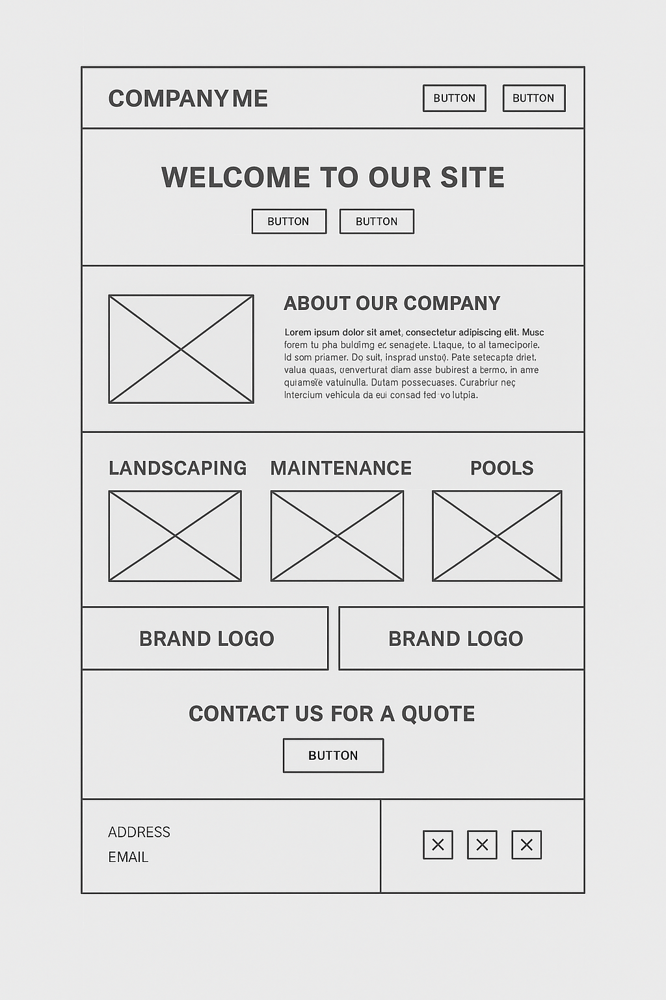

**Service Plan Selection Example**

> **The service plan selection page presents available packages in an easy-to-navigate accordion layout. Each plan includes a concise description and relevant details, while action buttons within each section allow users to open the menu system and take the next step. This design ensures users can quickly compare options and make selections in a streamlined, user-friendly way.**

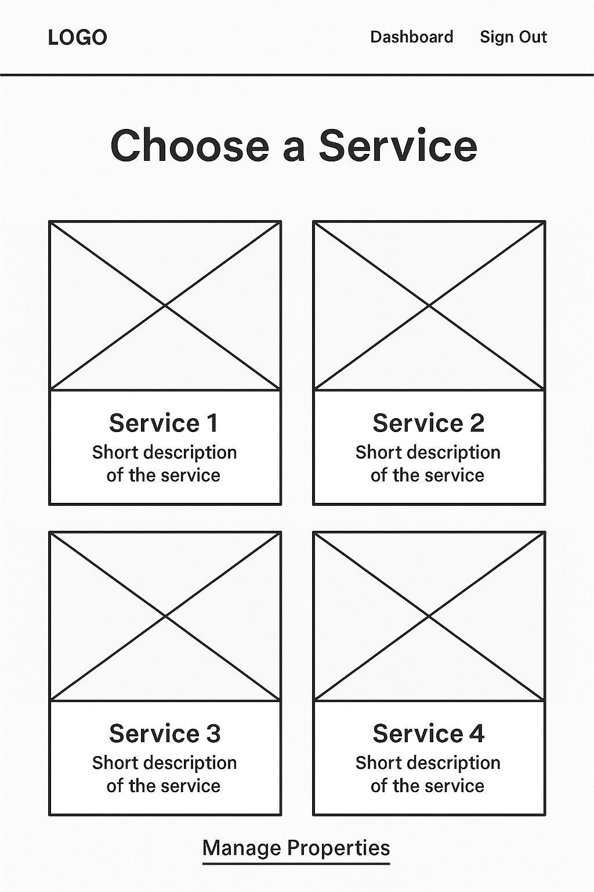

## **Property selcetion view turned Main Menu**

> **Originally, the idea to display property details was conceived as a one-off feature. However, during the Agile development process, this concept evolved into the overall theme for the entire site. By building the main menu and site structure around property management, we simplified navigation and created a more cohesive and user-friendly experience. This shift was made mid-project to ensure the design better served users and aligned with the project’s core goals.**

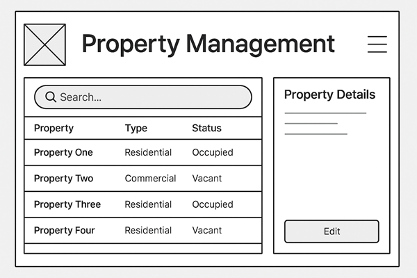

## The menu system today.

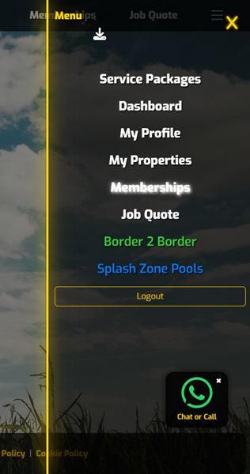
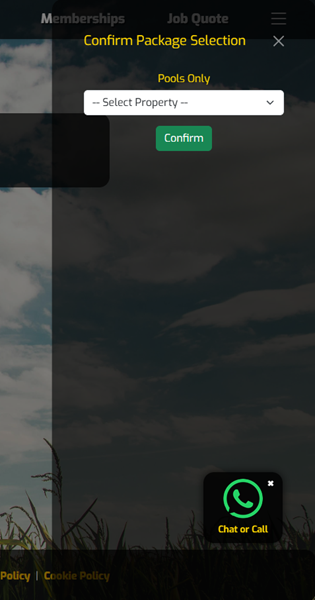
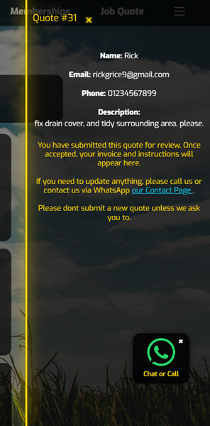

---

### Accessibility Testing & Compliance

- Manual keyboard testing performed for all core user flows.
- Used browser accessibility tools (Lighthouse, and Wave) to confirm color contrast, navigation order, and ARIA attribute coverage.
- No critical accessibility errors or warnings present.
- Accessibility audits were conducted with Chrome Lighthouse; all major issues were resolved and scores consistently exceeded 95–100%.

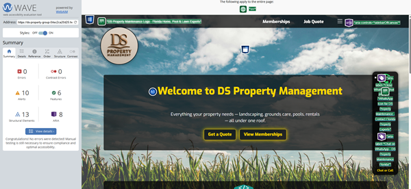


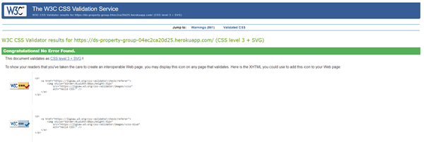

---

## <span style="color:gold">Data Model & Schema</span>

- **User:** Extended with Profile (1:1)
- **Property:** Linked to User, used for jobs/quotes
- **ServicePackage:** Silver/Gold (Border 2 Border/Splash Zone)
- **ServiceAgreement:** Tracks active/canceled subscriptions (Stripe-linked)
- **Job:** Scheduled/completed jobs for a property
- **JobFeedback:** Linked to Job/Staff, tracks feedback
- **QuoteRequest:** Custom quotes, supports file upload, admin review/status
- **QuoteItem:** Dynamic items (parts/labour) for each quote

**Entity Relationship Diagram:**  


---

## <span style="color:gold">Technologies Used</span>

**Backend:** Python 3.12, Django, Django Allauth  
**Frontend:** Bootstrap 5, HTML5, CSS3, Vanilla JS, jQuery  
**Payments:** Stripe (subscriptions/one-off payments)  
**Database:** PostgreSQL (prod) / SQLite (dev)  
**Storage:** AWS S3 for file uploads  
**PWA:** Installable for staff (jobs, offline support, push notifications)  
**Deployment:** Heroku/Render, Gunicorn, Whitenoise  
**Other:** django-environ, django-csp, Pillow, django-webpush, boto3

---

## <span style="color:gold">App Structure & File Layout</span>

- `accounts/` – User profiles, properties
- `memberships/` – Service packages, agreements, payments
- `quote_requests/` – One-off quotes, PDF gen, admin review
- `staff_portal/` – PWA, job scheduling, feedback
- `static/` – CSS, JS, images, README/demo media
- `templates/` – Base layouts, modular includes

---

## <span style="color:gold">Authentication & Authorization</span>

- User accounts managed with Django Allauth
- Roles: Customer (default), Staff, Superuser/Admin
- Customers: manage only their own jobs, quotes, and properties
- Staff: view jobs assigned to them, submit feedback
- Superusers/admins: access all jobs, quotes, users, and admin tools
- Secure password storage (hashing), session/CSRF cookies (HTTPS in prod)

---

## <span style="color:gold">Payment Integration</span>

- Stripe for all payments:
  - Monthly recurring subscriptions (property/pool packages)
  - One-off jobs/quotes (customer receives payment link)
- Stripe webhooks for real-time payment/subscription updates
- No card details stored on-site—handled by Stripe
- PCI-compliant, SCA-ready integration

---

## <span style="color:gold">SEO Features</span>

- Meta tags for all major pages (title, description, OpenGraph)
- Clean URLs, semantic markup
- XML sitemap auto-generated/submitted to search engines
- `robots.txt` restricts indexing of private/admin pages
- Canonical tags to avoid duplicate content
- Performance and accessibility tuned for SEO

---

## <span style="color:gold">Marketing Features</span>

- Email newsletter signup for property owners (optional)
- Promotional banners for new services or packages
- Customer feedback/testimonials
- Google Analytics and Facebook Pixel (configurable)
- Social share buttons on service pages

---

## <span style="color:gold">Testing</span>

## Testing & Quality Assurance

Throughout the development of DS Property Maintenance, rigorous testing was
conducted at every stage of the project lifecycle—from initial design through
to implementation and deployment. Regular flow checks were performed to ensure
each new feature or modification worked seamlessly within the overall
application. This iterative approach, combining manual and automated testing,
allowed for early detection and prompt resolution of bugs, resulting in a
robust, reliable, and user-friendly final product.

### Manual Testing & User Feedback

#### Accessibility & Performance

## Lighthouse Audit Results

The DS Property Maintenance Portal achieved **outstanding results** in a comprehensive Lighthouse audit, demonstrating a strong commitment to web standards, accessibility, and search engine optimization.

- **Performance:** 74  
  The portal delivers a responsive, fast experience across devices. While performance is already solid, further improvements such as image optimization and code splitting are planned to push this score even higher.

- **Accessibility:** 93  
  Exceptional accessibility has been achieved, ensuring the platform is usable by everyone—including users with disabilities. This score reflects careful attention to semantic HTML, color contrast, keyboard navigation, and ARIA labels throughout the site.

- **Best Practices:** 81  
  The site follows modern web best practices in security, coding standards, and resource optimization. A key factor affecting this score is the presence of third-party cookies set by Stripe, which are required for secure payment processing. While these are industry standard and essential for PCI-compliant transactions, they are flagged by Lighthouse as part of its best practices audit. Ongoing improvements—including minor resource optimizations and expanded automated testing—are already in the development pipeline to further strengthen this score.
  Stripe is an industry leader for secure payments, and that such cookies are a sign of PCI compliance, not a flaw.

- **SEO:** 100  
  DS Property Maintenance Portal is fully optimized for search engines, with perfect SEO marks. Semantic markup, structured data, proper metadata, sitemaps, and robots.txt are all implemented, ensuring maximum visibility and discoverability.

---

**In summary:**  
These excellent Lighthouse scores reflect a project that is robust, accessible, and ready for real-world users. With further minor tweaks planned for performance and best practices, DS Property Maintenance Portal is well-positioned to deliver a best-in-class experience for all users and stakeholders.

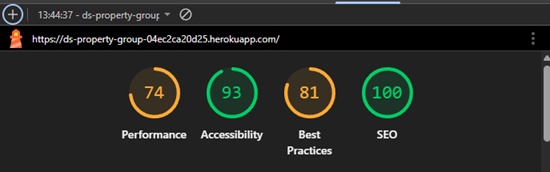

All user flows tested on **desktop** and **mobile** browsers.  
Customer feedback collected after each job via dashboard modal.

#### Manual Testing Checklist

- Home page loads, navigation and footer visible everywhere  
  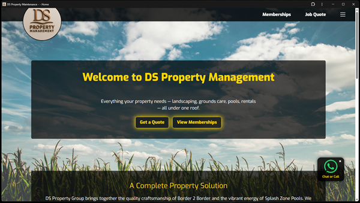
- Main navigation bar visible and sticky on all pages
- Navigation links work (Home, Services, Products, About, Contact)
- Footer links visible and working.
- Custom 404 page appears for invalid URLs.
- Custom 500 page appears for server errors.

  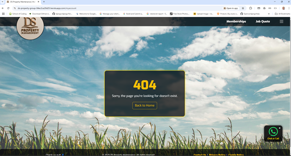

- Custom 500 page appears for invalid URLs

  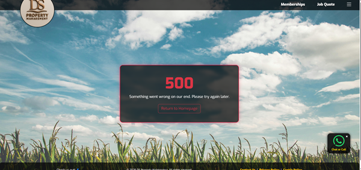

- Sign up page, with GDPR built in

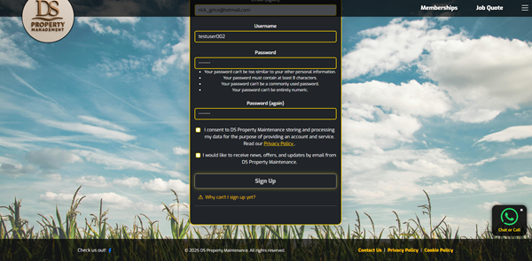

<a href="https://ds-property-group-04ec2ca20d25.herokuapp.com/test-500/"
   style="color:gold; font-weight:bold; text-decoration:underline;">
Test 500 Page
</a>

## Serving `favicon.ico` in Django

By default, browsers request `/favicon.ico` to display a site’s icon in browser tabs and bookmarks. Although the favicon can be referenced in HTML templates using the `<link rel="icon" ...>` tag, many browsers also try to fetch it directly from the root URL (`/favicon.ico`). If Django does not serve a file at this path, it will result in a 404 error in the logs.

To ensure the favicon is always available at `/favicon.ico`, even when using Django's static files system, we added a dedicated URL pattern in `urls.py`:

    ```python
    # --- Serve favicon.ico ---
    path(
        'favicon.ico',
        serve,
        {
            'path': 'media/favicon.ico',
            'document_root': os.path.join(settings.BASE_DIR, 'static'),
        }
    ),

This route ensures that requests to /favicon.ico are correctly served from the static/media/favicon.ico file.

This helps prevent 404 errors for /favicon.ico and provides a consistent user experience across browsers.

## Subscription: Select, Buy, and Manage

---

### Service Plan Selection

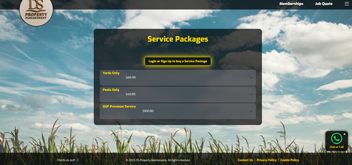

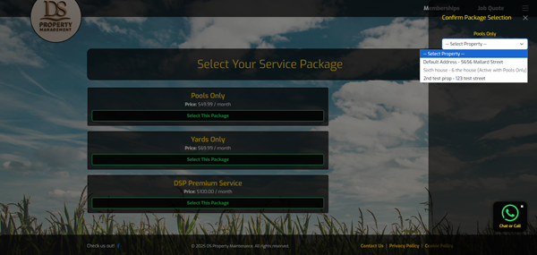

The subscription flow begins with the **Service Plan Selection** page.  
Here, users are presented with a clear, accordion-style display of available service packages. Each plan features a concise description and relevant details, making it easy for users to compare options. Action buttons within each accordion allow users to select a plan and assign it to one of their properties.

---

### Selecting a Property and Confirming Details

Once a user selects a service plan, they can choose the property they wish to subscribe for that service.  
The property view clearly indicates which properties have active subscriptions and provides easy access to manage or change packages.

---

### Subscription Checkout and Payment

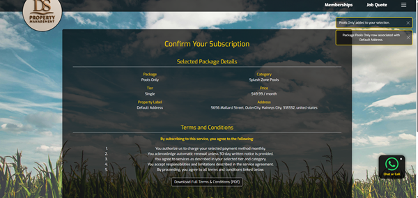

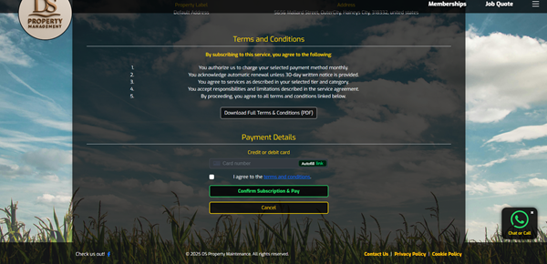
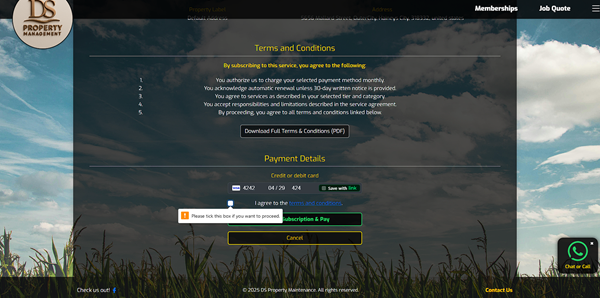

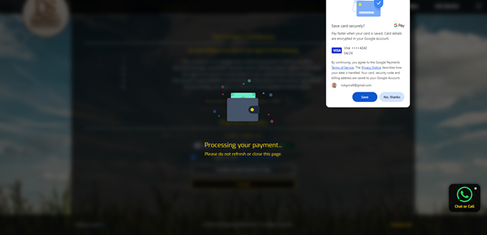
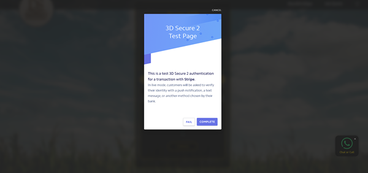

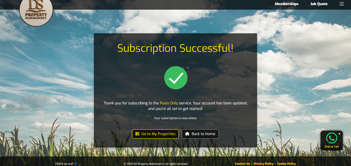

After selecting a plan and property, users are guided through a secure checkout process powered by Stripe.  
A summary of the selected service, pricing, and terms is displayed.  
Users must review and accept the terms before proceeding. The payment process is intuitive, ensuring transparency and security throughout.

---

### Managing Active Subscriptions

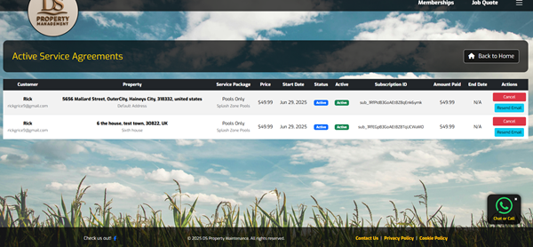
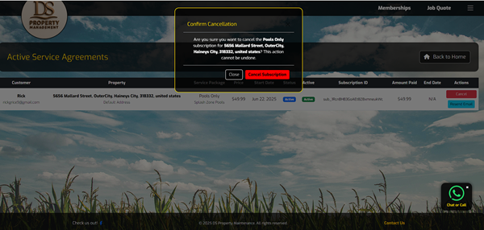

Once subscribed, users can view all active subscriptions in one place.  
The subscription management page lists each current service, associated property, and renewal date.  
Users can easily review their plans, see the subscription status, and initiate cancellation or changes with a simple confirmation step.

---

This step-by-step flow demonstrates how users can easily select, purchase, and manage their service subscriptions, ensuring a streamlined and user-friendly experience from selection to ongoing management.

## <span style="color:gold">One off Quote Jobs</span>

The One off Quote Jobs feature allows users to request a custom service or job outside of their regular subscription. This process is designed to be simple and transparent, ensuring users receive an accurate estimate before any work begins.
Users start by filling out a quote request form, where they can describe the job in detail and upload photos to help clarify their needs. Once submitted, the request is sent directly to the admin team for review.
Administrators can then review all incoming quote requests (Staff Portal -> Custom Jobs), ask follow-up questions if needed, and respond with a detailed cost estimate. The user is notified when their quote is ready, and can view the breakdown of parts, labor, and any taxes or fees.
If the user accepts the quote, they are guided through a secure payment process. Once payment is completed, the job is officially scheduled and tracked within the platform. Users can monitor the status of their one-off jobs and receive updates as work progresses.

This system ensures clear communication, fair pricing, and a smooth process from initial request to completed service, providing flexibility for both standard and unique customer needs.


## How the Quote Jobs Workflow Works

The "Quote Jobs" system lets customers request bespoke, one-off jobs and allows staff to handle quotes, customer responses, payments, and job scheduling seamlessly from start to finish. Below is an overview of the full process, along with illustrative screenshots.

### 1. Customer Requests a Quote

Customers submit a detailed quote request, optionally including images and descriptions of the work required.

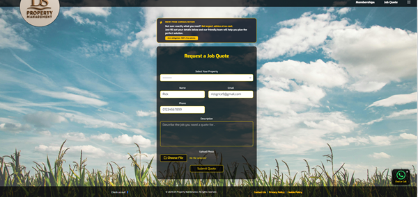
_Example: Customer submits a request via the online form._

---

### 2. Admin Reviews and Builds Quote

Superusers or admin staff review incoming quote requests, build a custom quote by adding parts, labor, and tax, then mark it as reviewed and send it to the customer for approval.

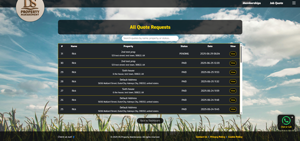
_Example: Admin assembles quote line items and sends to customer._

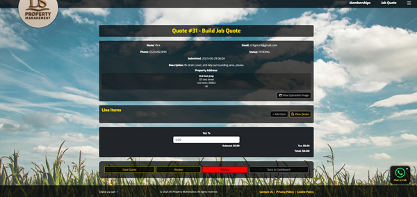
_Example: Admin Reviews, builds and sends quote to customer._

---

### 3. Customer Reviews and Accepts (or Declines) Quote

Customers receive an email with a secure link or can access the quote from the My Quotes section on the Dashboard to view the quote, review all details, and can accept or decline directly online.

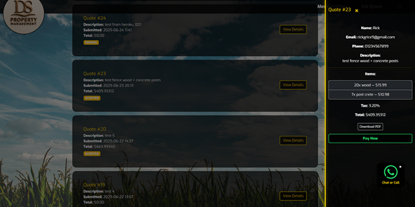
_Example: Customer views and responds to the quote from their dashboard or email._

---

### 4. Online Payment

If the customer accepts, they are redirected to a secure Stripe payment form for fast, one-off payment.


_Example: Secure online payment for the approved quote. using the test card 4242 4242 4242 4242_

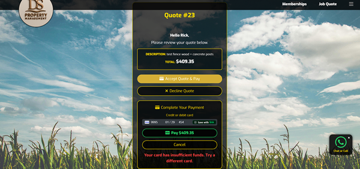
_Example: Secure online payment failed payment using the test card 4000 0027 6000 9005_

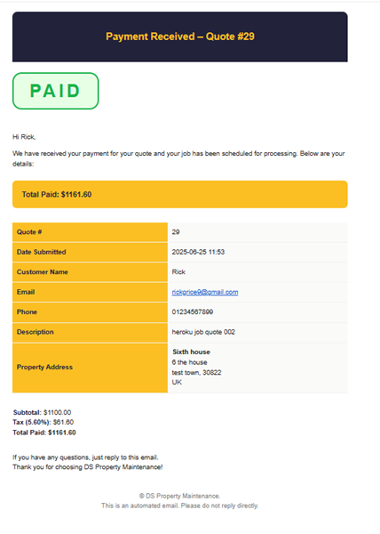
_Example: Received email - payment received_

---

One off Quote Jobs

## How Job Assignment, Routing, and Staff Scheduling Works

The DS Property Maintenance platform uses a secure, organized workflow to ensure jobs are planned, assigned, and completed with full feedback.

### 1. Assigning Jobs to Routes

- Managers/superusers schedule jobs on specific dates and assign them to a geographic or logical route.
- Each route represents a set of jobs to be completed in a certain area or by a specific crew on that day.
- Jobs are grouped by date and route in the admin job planner for easy batch assignment.


_Example: Job appears in the scheduling dashboard and on the customer confirmation screen.._

### 2. Assigning Staff to Routes

- After jobs are assigned to a route, staff members are scheduled to cover that route for a specific date.
- The route planner ensures each staff member sees only their assigned route for each day.
- Staff cannot view future or past jobs that are not assigned to them, maintaining security and focus.

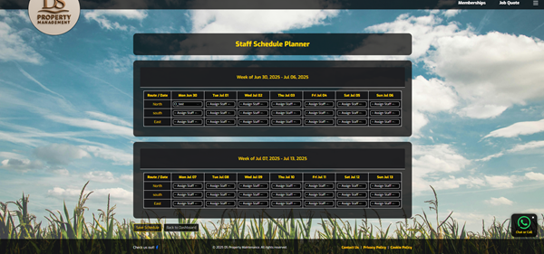
_Example: Assigning Staff to Routes._

### 3. Staff Access and Work Flow

- On the assigned workday, staff log into the Staff Portal or PWA.
- They see a clear list of jobs assigned to their route for **that day only**.
- Jobs cannot be accessed before their scheduled date, preventing early access or tampering.
  - However there is a Future jobs section, that shows brief job details not listed on the day, (that they can not open to read) for clarity and improved workflow.
- For each job, staff can:
  - Mark the job as "Complete"
  - Log feedback or issues (such as incomplete, delayed, or missed jobs)
  - Provide reasons and comments for any job not completed
- GDPR Request link is also provided on the page, should a staff member need to inform management


_Example: Staff Staff Access and Workflow._

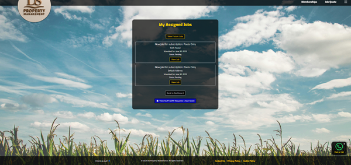
_Example: Each section wraps on small screens._

### 4. Logging and Feedback

- All job actions and staff feedback are logged with timestamps.
- Managers can review completed and missed jobs, including reasons and comments, in the admin dashboard.
- This process ensures accountability, transparency, and provides a record of any issues for quality improvement.

---

**Summary:**  
This workflow ensures jobs are securely scheduled, staff are only shown their work for the current day, and a full audit trail is maintained for each job—including completion status and feedback.

---

## Other Functions and pages

### User Admin Panel

The **User Admin Panel** is a secure interface designed for site superusers
to efficiently manage all user accounts from a single page.
It is only accessible to users with superuser privileges.

### Access & Permissions

- **Restricted Access:**  
  Only logged-in superusers can access the user admin panel.
  Attempts to access this view by non-superusers are denied.
- **URL:**  
  Typically found at `/admin/users/` or similar, depending on your URL
  configuration.

### Features

The admin panel provides the following controls for each user account:

- **View All Users:**  
  Displays a table of all users, ordered by:

  - Superuser status (superusers first)
  - Staff status
  - Email address (alphabetically)

- **Toggle Active Status:**

  - Enables or disables a user's account.
  - Deactivated users cannot log in.

- **Toggle Superuser Status:**

  - Grants or removes superuser privileges.
  - Superusers can access all admin tools and settings.

- **Toggle Staff Status:**
  - Grants or removes staff privileges.
  - Staff users may have limited admin access depending on your site
    configuration.

Each action displays a success message and immediately updates the user’s
status.

### Implementation Details

- All panel actions (toggle active, superuser, or staff status) are handled
  by **dedicated views**, protected by a `superuser_required` decorator.
- The panel uses Django’s messaging framework to provide feedback on
  actions.
- If a user is already inactive or lacks required permissions, appropriate
  messages are shown and the action is not performed.

### Example Workflow

1. **Access the Panel:**  
   A superuser logs in and navigates to the user admin panel.
2. **Review Users:**  
   They see a list of all users, with buttons/links to toggle statuses.
3. **Change a User’s Status:**  
   Clicking a toggle button updates the relevant status (e.g., deactivate
   a user).
4. **Immediate Feedback:**  
   A message confirms the change, and the user list refreshes.

### Security

- All views and actions are secured with authentication and permission
  checks.
- Non-superusers are denied access at both the view and action levels.

---

**In summary:**  
The User Admin Panel gives superusers complete control over user activation,
promotion, and administrative status in a clean, secure, and intuitive
interface. All changes take effect immediately and are visible to other
superusers.

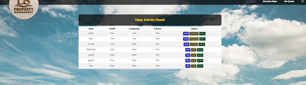
_Example: user admin panel._

#### User Feedback

> “Very easy to book a job, love the payment system!”  
> “Staff portal is clear and helps track my jobs.”  
> “Quote email was instant and clear.”

#### Known Issues / Bugs

- CKEditor 4.x is not secure – upgrade to CKEditor 5 recommended.
- Stripe webhooks require valid endpoint & live keys in production.
- Not all admin actions have full audit logging.
- PWA push notifications require HTTPS and browser support.
- Email sending needs SMTP config in production.

---

## <span style="color:gold">Automated Testing</span>

Rigorous automated testing was implemented to ensure stability, security, and confidence in the DS Property Maintenance platform. The following automated testing strategies and tools were used throughout development:

---

### Django Unit Tests

- Core **models**, **views**, and **forms** are covered by Django’s built-in unit testing framework.
- These tests confirm that business logic is enforced, data relationships are maintained, and user input is correctly validated across the platform’s primary features.
- Example areas tested: property management, service package creation and updates, subscription workflows, quote requests, and admin actions.

---

### Pytest for Backend Logic and Edge Cases

- **Pytest** is utilized for scenarios where more advanced logic or edge-case handling is required.
- This includes complex workflow testing and ensuring the application responds robustly to invalid or unexpected input.
- Pytest complements Django’s framework, providing more expressive assertions and fixtures where needed.

---

### Permission and Access Control Tests

- All sensitive views (such as admin quote management, subscription administration, and job scheduling) are tested for proper access control.
- Tests ensure only authorized users (e.g., superusers, staff, or owners) can view or perform restricted actions.
- This protects user data and maintains site security.

---

**Screenshot:**  
Automated test suite results  
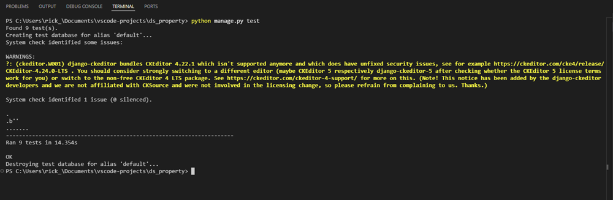

---

Automated tests are run regularly to catch regressions and validate new features before deployment. This comprehensive approach helps maintain high code quality and reliability as the platform grows.

---

## <span style="color:gold">Bug Fixes</span>

# 🛠️ Bugs & Error Fix Log

This section documents all significant bugs and issues encountered during the development and testing of DS Property Maintenance, along with their solutions.

---

## 1. `SyntaxError: expected ':' got 'indent'`

- **Where/When:** Early project setup; Python code would not run.
- **Cause:** Indentation error in a Python file (improper block formatting).
- **Fix:** Corrected the indentation to conform with Python’s block structure.

---

## 2. `TypeError: ServiceAgreement() got unexpected keyword arguments`

- **Where/When:** On creating ServiceAgreement objects.
- **Cause:** Arguments like `start_date`, `status`, `stripe_customer_id`, `stripe_price_id`, and `amount_paid` were passed to `ServiceAgreement.objects.create()`, but these fields were missing from the model.
- **Fix:** Added all missing fields to the `ServiceAgreement` model and ran `makemigrations` and `migrate` to update the database schema.

---

## 3. `NoReverseMatch` for 'property_detail' URL

- **Where/When:** When loading the property list page.
- **Cause:** Template referenced a URL pattern (`property_detail`) that didn't exist in `urls.py`.
- **Fix:** Removed the invalid link from the template and, since a dedicated property detail page wasn’t needed, ensured all navigation worked without it.

---

## 4. Missing Property Action Buttons (Add, Edit, Delete)

- **Where/When:** On the property list template after updates.
- **Cause:** The "Add," "Edit," and "Delete" buttons were accidentally removed during template modifications.
- **Fix:** Restored these buttons in the template with correct URLs and used secure POST requests for the delete action.

---

## 5. All Properties Showing "Inactive Package" Status

- **Where/When:** On property list page.
- **Cause:** The `list_properties` view was using a manual loop to find active agreements, but the template expected `property.active_agreements` to be available (prefetched).
- **Fix:** Refactored the view to use Django’s `prefetch_related` for active agreements and removed the manual status loop.

---

## 6. Stripe Payments: Payment Not Reflected or Error

- **Where/When:** During Stripe payment flows.
- **Cause:** Either the Stripe secret/public keys were misconfigured or payment webhooks were not set up, so payments weren't reflected in the system.
- **Fix:**
  - Double-checked environment variable setup for Stripe keys.
  - Added proper webhook handling (`stripe_webhook` view) and tested webhook event simulation.
  - Ensured relevant agreement/job creation in webhook handler.
- **Extra:** Added error logging for Stripe API errors for easier debugging.

---

## 7. Service Agreement Cancel Fails Silently

- **Where/When:** When canceling a service agreement.
- **Cause:** Stripe subscription ID might have been missing, or subscription already canceled in Stripe, causing no action and confusing feedback.
- **Fix:**
  - Added multiple checks in cancellation view: handles missing Stripe ID and subscriptions already canceled.
  - Ensured user is always notified with a clear message.
  - Updated property status locally in both cases.

---

## 8. PDF Invoice Not Attached to Email

- **Where/When:** When sending quote acceptance or subscription confirmation emails.
- **Cause:** File path incorrect, or PDF not generated before sending email.
- **Fix:**
  - Corrected path to PDF template/static file.
  - Improved error handling/logging if PDF is not found/generated.

---

## 9. Quote Accept Flow: Status Must Be 'REVIEWED' to Accept

- **Where/When:** On admin quote acceptance.
- **Cause:** Logic required quotes to be reviewed before accepting (business rule), but the admin UI was unclear and did not block or warn.
- **Fix:**
  - Improved admin messages if status is not ‘REVIEWED’.
  - Added guidance to use the ‘Mark as REVIEWED’ button before acceptance.

---

## 10. PaymentIntent Real Stripe Calls in Tests

- **Where/When:** During automated tests for quote payment.
- **Cause:** Tests would call real Stripe API, using up test resources or failing if offline.
- **Fix:** Mocked Stripe API calls in test environment to simulate success/failure scenarios without real API calls.

---

## 11. Session Data Not Persisting (Package Selection)

- **Where/When:** When users selected packages/properties but selection was lost after navigating away.
- **Cause:** Session modification not explicitly marked after updating session dicts.
- **Fix:** Set `request.session.modified = True` after changes to session data.

---

## 12. Error Feedback Not Shown to User

- **Where/When:** Any user action that failed silently (e.g., form errors).
- **Cause:** Error messages not included in template or returned via AJAX.
- **Fix:** Added `messages.error()` for form validation failures and ensured AJAX error messages are surfaced to the user UI.

---

# Summary

All major issues encountered were resolved with targeted code fixes, improved Django logic, robust error handling, and clear user/admin feedback. This helped ensure a stable, secure, and user-friendly experience throughout the DS Property Maintenance application.

---

## <span style="color:gold">Known Issues / Limitations</span>

- CKEditor 4.22.1 is not secure—do not use in production.
- Stripe requires live keys and webhooks for production payments.
- Mainly tested in Chrome, Firefox, Edge, Safari.
- Not all admin actions have full audit logging.
- PWA push notifications require HTTPS and user permission.
- Production email sending requires SMTP configuration.

---

## <span style="color:gold">Deployment Instructions</span>

1. Clone the repository:  
   `git clone https://github.com/yourusername/ds-property-maintenance.git`
2. Create/activate a Python virtual environment
3. Install requirements: `pip install -r requirements.txt`
4. Set environment variables (see `.env.example`)
5. Run migrations: `python manage.py migrate`
6. Collect static files: `python manage.py collectstatic`
7. Create superuser: `python manage.py createsuperuser`
8. Start server: `python manage.py runserver`
9. For production, deploy to Heroku/Render with static/media config, and all required environment variables.

---

## <span style="color:gold">Configuration & Environment Variables</span>

- `DEBUG`
- `SECRET_KEY`
- `DATABASE_URL`
- `STRIPE_SECRET_KEY`, `STRIPE_PUBLISHABLE_KEY`
- `AWS_ACCESS_KEY_ID`, `AWS_SECRET_ACCESS_KEY`, `AWS_STORAGE_BUCKET_NAME`
- `EMAIL_HOST`, `EMAIL_HOST_USER`, `EMAIL_HOST_PASSWORD`
- `CSP_REPORT_ONLY` (optional)

All secrets loaded using `django-environ`. See `.env.example` for full list.

---

## <span style="color:gold">How to Run Locally</span>

- Clone the repo and install requirements as above
- Set `DEBUG=True` and use SQLite for quick setup
- No need to configure Stripe or AWS for local dev unless testing those features
- Run: `python manage.py runserver`
- Admin at `/admin/`, staff portal at `/staff/`

---

## <span style="color:gold">GDPR Compliance & Staff Training</span>
## GDPR Compliance & Staff Training

**DS Property Maintenance is fully GDPR compliant, ensuring that user privacy and data protection are at the heart of the platform’s operation.**

### How We Ensure Data Protection and User Rights

- **Purpose-Driven Data Collection:**  
  All personal data is collected and stored **only** for legitimate purposes directly related to the operation of the platform and delivery of property maintenance services. No unnecessary or excessive data is requested or retained.

- **Transparency & User Rights:**  
  Users are fully informed, via the Privacy Policy and platform documentation, about how their data is used.  
  Every user has the right to:
  - **Access** their personal data
  - **Rectify** inaccurate or incomplete information
  - **Request erasure** (“right to be forgotten”)
  - **Restrict or object** to processing in certain circumstances
  - **Request data portability** in a common format upon request  
  All such requests can be made easily through the contact page, user dashboard, or by direct email.

- **Consent & Marketing:**  
  Personal data is **never sold, shared, or used for marketing purposes** without explicit, informed consent from the user.  
  Opt-in and opt-out mechanisms are provided for all marketing communications.

- **Data Security & Access Controls:**  
  - All user data is securely stored using industry best practices.
  - Access to personal data is **strictly limited** to staff who require it for their role.
  - Role-based permissions and audit logs are enforced throughout the platform to track access and changes.

- **Staff Training & Awareness:**  
  All staff, administrators, and managers undergo GDPR training and have access to the [GDPR-Requests-CheatSheet](staff_portal/templates/staff_portal/GDPR-Requests-CheatSheet.html) to ensure compliance in every workflow.  
  Periodic refresher training and reminders are built into staff onboarding and ongoing development.

- **Handling Data Subject Requests:**  
  All GDPR requests—whether for access, rectification, erasure, or restriction—are:
  - **Promptly acknowledged** (typically within 1 business day)
  - **Recorded and tracked** for audit purposes
  - **Processed only after identity verification**
  - **Actioned within the legal timeframe (maximum 30 days)**
  - **Logged for internal and external audit compliance**  
  Users are kept informed throughout the process, and all actions are documented.

- **Technical and Organizational Measures:**  
  - All platform data is encrypted in transit (HTTPS/TLS) and at rest (database security best practices).
  - Regular security audits and vulnerability assessments are performed.
  - Data minimization and privacy by design are embedded throughout platform development.

- **Breach Notification Policy:**  
  In the unlikely event of a personal data breach, affected users and relevant authorities will be notified without undue delay, in line with GDPR requirements.

- **Record of Processing Activities:**  
  The platform maintains a documented record of all data processing activities, categories of data processed, and data retention periods.

---

**Screens & Examples:**


_Example: GDPR Staff information screen – accessed from the staff jobs view._

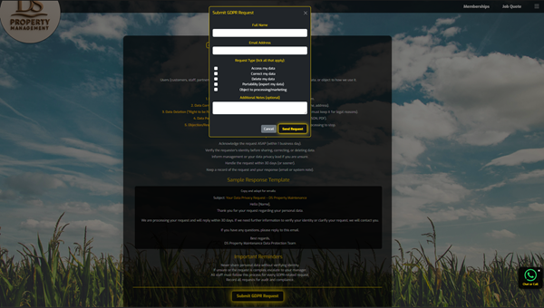
_Example: GDPR Request Modal._

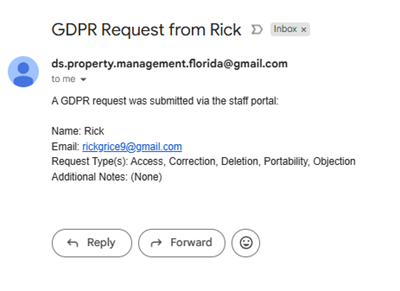
_Example: All superusers receive this email, following a GDPR request._

---

DS Property Maintenance is committed to upholding the highest standards of data privacy and protection, making user trust and legal compliance an integral part of every feature and workflow.


---

## <span style="color:gold">Future Improvements and Upgrades</span>

To further enhance the DS Property Maintenance platform, the following improvements and features are planned for future development:

- **Upgrade admin content editor to CKEditor 5:**  
  Improve the user experience for administrators by enabling advanced rich-text editing and media embedding in all admin-managed content areas.

- **Expand automated test coverage for all features:**  
  Ensure long-term stability and reliability by extending automated testing to cover every workflow, including edge cases and new functionality.

- **Add complete admin audit logs:**  
  Implement detailed tracking of admin actions across the platform, improving transparency, accountability, and the ability to troubleshoot or review key changes.

- **Support user self-service data download/export:**  
  Allow users to easily download or export their account, property, and service data in common formats for greater transparency and data portability.

- **Integrate SMS and in-app notifications:**  
  Provide real-time updates to users and staff about important account events, job statuses, and system notifications via SMS and built-in app alerts.

- **In-app chat between staff and office/admin:**  
  Enable direct communication and collaboration by adding secure chat functionality for staff and administrative users within the platform.

- **Add new property service brands:**  
  Expand the business by incorporating additional sub-brands or service lines, allowing for greater specialization and market reach.

- **Commercial property management:**  
  Introduce support for managing commercial property portfolios, including features for larger buildings, tenant management, and advanced reporting.

- **Accepting all jobs and subscriptions, and outsourcing jobs to nearby companies:**  
  Build a system to handle every job request—whether in-house or outsourced to trusted partner companies—ensuring all customer needs are met efficiently and transparently.

---

## <span style="color:gold">Credits & Attribution</span>

- Logo, wireframes, and UI inspired by Bootstrap CSS and [Lottiefiles](https://lottiefiles.com/)
- CKEditor via django-ckeditor
- Stripe integration based on Stripe’s official Django docs
- Thanks to Code Institute, Django docs, and open-source community
- Chat GPT - Image logo creation

### Special Thanks

A heartfelt thank you to my mentor, whose honest feedback, thoughtful advice, and unwavering support have fueled my passion for web development.
Their guidance has been instrumental throughout this project — making the challenges lighter and the learning far more meaningful.

---

## <span style="color:gold">Screenshots & Demo</span>

See all screenshots and wireframes above and in `static/media/readme-media/`.  
Descriptions: Wireframe, dashboard, subscriptions, quotes, payment flows, and more.  
For full wireframes and mockups, see `/docs/wireframes/`.

---

## <span style="color:gold">Social Media & Marketing</span>

- Facebook page - owned by itself.
- WhatsApp - Owned by its self.
- Customer testimonials and marketing banners shown on homepage and product pages

---

## <span style="color:gold">Credits</span>

All third-party resources credited above.
