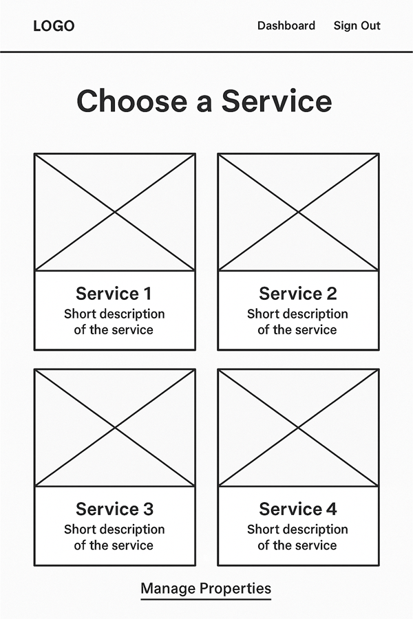

# DS Property Management

---

## Prerequisites & Viewing Notes

- This README is designed to be viewed on platforms or editors that support **dark mode** or **black backgrounds** for optimal readability, especially for gold and white text sections.
- Gold-highlighted headings and certain images may appear less readable or visually appealing on a white or light background.
- For best results, use a Markdown viewer, code editor, or GitHub dark theme.
- Some screenshots, UI mockups, and wireframes are shown as designed for a dark-themed web interface.
- If any color contrast or formatting issues are seen in your viewer, please try switching to dark mode or a compatible Markdown app.

---

## Table of Contents

- [Project Overview](#project-overview)
- [Business Model & Purpose](#business-model--purpose)
- [Key Features](#key-features)
- [User Stories](#user-stories)
- [UX Design & Accessibility](#ux-design--accessibility)
- [Data Model & Schema](#data-model--schema)
- [Technologies Used](#technologies-used)
- [App Structure & File Layout](#app-structure--file-layout)
- [Authentication & Authorization](#authentication--authorization)
- [Payment Integration](#payment-integration)
- [SEO Features](#seo-features)
- [Marketing Features](#marketing-features)
- [Testing](#testing)
- [Manual Testing & User Feedback](#manual-testing--user-feedback)
- [Automated Testing](#automated-testing)
- [Bug Fixes](#bug-fixes)
- [Known Issues / Limitations](#known-issues--limitations)
- [Deployment Instructions](#deployment-instructions)
- [Configuration & Environment Variables](#configuration--environment-variables)
- [How to Run Locally](#how-to-run-locally)
- [GDPR Compliance & Staff Training](#gdpr-compliance--staff-training)
- [Future Improvements](#future-improvements)
- [Credits & Attribution](#credits--attribution)
- [Screenshots & Demo](#screenshots--demo)
- [Social Media & Marketing](#social-media--marketing)
- [Credits](#credits)

---

## Project Overview

### DS Property Maintenance Portal

**A Full-Stack Django E-commerce Solution for Florida Property Owners & Managers**

A modern, secure platform for property owners, landlords, and managers to buy services, set up subscriptions, and access expert advice and consultation.

The portal allows users to:
- Browse and purchase recurring property maintenance services (subscriptions)
- Request custom, one-off jobs or quotes (with photo upload)
- Manage service contracts, schedules, and payments in a secure, user-friendly environment

---

## Business Model & Purpose

- Two specialized sub-companies:
  - **Border 2 Border:** Landscaping, gardening, grounds, fencing, tree work.
  - **Splash Zone Pools:** Pool cleaning, repair, and maintenance.
- Customers can:
  - Purchase ongoing maintenance packages (subscriptions)
  - Request/pay for one-off jobs or custom quotes
  - Access professional advice and consultation

Hybrid model: digital management + real-world service delivery.  
Staff use the PWA on their phones/tablets for jobs, feedback, and updates.

---

## Key Features

- Multi-brand portal (Border 2 Border + Splash Zone Pools)
- Recurring service package subscriptions (Stripe-powered)
- Dynamic, itemized one-off quotes with image upload
- Role-based dashboards (customer, staff, admin)
- Admin tools for job assignment, scheduling, and feedback
- PWA for staff (mobile job management, push notifications)
- Secure authentication (Django Allauth)
- Robust permission controls
- SEO optimized structure
- Secure, PCI-compliant Stripe payments
- Real-time feedback and updates for customers

---

## User Stories

### Customers
- Register/login and reset password (Django Allauth)
- Browse services, add to basket, secure checkout
- Request and view custom quotes, leave feedback
- Responsive design across all devices

### Staff/Admin
- Dashboard of all jobs/requests/quotes
- CRUD for services, packages, agreements
- Assign jobs, view feedback, mark as complete/missed

### Developer
- Cloud deployment
- Automated/manual testing
- Error handling and robust security

---

## UX Design & Accessibility

- Mobile-first responsive design (Bootstrap & Bootstrap CSS + custom styles)
- Consistent navigation (header/footer)
- Semantic HTML for screen reader support
- High color contrast and readable fonts (WCAG 2.1 AA)
- ARIA labels/roles on key elements
- All forms: visible labels, placeholders, error messages
- Keyboard accessible (tab order tested)
- Touch-optimized components (large tap targets, offcanvas nav)
- Real-time feedback (toast messages, confirmations)

Wireframes and mockups in `/docs/wireframes/` and [Screenshots & Demo](#screenshots--demo).

---

## Data Model & Schema

- **User:** Extended with Profile (one-to-one)
- **Property:** Linked to User, used for jobs/quotes
- **ServicePackage:** Defines Silver/Gold (Border 2 Border/Splash Zone)
- **ServiceAgreement:** Tracks active/canceled subscriptions (linked to Stripe)
- **Job:** Scheduled/completed jobs for a property
- **JobFeedback:** Linked to Job/Staff, tracks feedback
- **QuoteRequest:** Custom quotes, supports file upload, admin review/status
- **QuoteItem:** Dynamic items (parts/labour) for each quote

See `/myapp_models.png` for a relationship diagram.

---

## Technologies Used

**Backend:** Python 3.12, Django, Django Allauth  
**Frontend:** Bootstrap 5, HTML5, CSS3, Vanilla JS, jQuery  
**Payments:** Stripe (subscriptions and one-off payments)  
**Database:** PostgreSQL (prod) / SQLite (dev)  
**Storage:** AWS S3 for file uploads  
**PWA:** Installable for staff (real-time jobs, offline support, push notifications)  
**Deployment:** Heroku/Render, Gunicorn, Whitenoise  
**Other:** django-environ, django-csp, Pillow, django-webpush, boto3

---

## App Structure & File Layout

---

## Authentication & Authorization

- User accounts managed with Django Allauth (registration, login, password reset)
- Roles: Customer (default), Staff, Superuser/Admin
- Customers can view/manage their own jobs, quotes, and properties only
- Staff can view jobs assigned to them and submit feedback
- Superusers/admins can access all jobs, quotes, users, and admin tools
- Secure password storage (hashing)
- Session and CSRF cookies are secure (HTTPS-only in production)

---

## Payment Integration

- Stripe for all payments:
  - Monthly recurring subscriptions (property/pool packages)
  - One-off jobs/quotes (customer receives payment link)
- Stripe webhooks handle payment and subscription status updates in real time
- No payment card details are stored on the site—handled entirely by Stripe
- PCI-compliant, SCA-ready integration

---

## SEO Features

- Meta tags for all major pages (title, description, OpenGraph)
- Clean URLs, semantic markup
- XML sitemap auto-generated and submitted to search engines
- `robots.txt` restricts indexing of private/admin pages
- Canonical tags to avoid duplicate content
- Performance and accessibility tuned for SEO

---

## Marketing Features

- Email newsletter signup for property owners (optional)
- Promotional banners for new services or packages
- Customer feedback/testimonials
- Google Analytics and Facebook Pixel (easy to enable/disable)
- Social share buttons on service pages

---

## Testing

- **Manual testing:**  
  - Registration, login, password reset
  - Subscription sign-up and Stripe payment (using test cards)
  - Quote request, admin review, and acceptance flow
  - Staff portal job assignment, marking jobs as complete/missed
  - Permissions: Ensured unauthorized users cannot access admin/staff pages
  - PWA installability, push notification flows

- **Automated testing:**  
  - Django unit tests for models, views, and forms
  - Pytest for backend logic and edge cases
  - Stripe integration tested with Stripe CLI and test cards

---

# Manual Testing & User Feedback

## Accessibility and Performance

- **Lighthouse Audits:**  
    | Category        | Score |
    |-----------------|-------|
    | Performance     | 99    |
    | Accessibility   | 93    |
    | Best Practices  | 78    |
    | SEO             | 100   |

- All user flows tested on **desktop** and **mobile** browsers.
- **Customer feedback** collected after each job via dashboard modal.

---

## 1. General Navigation

- Home page loads and displays correctly

- [ ] Main navigation bar visible and sticky on all pages
- [ ] Navigation links work (Home, Services, Products, About, Contact)
- [ ] Footer links visible and working
- [ ] Custom 404 page appears for invalid URLs

---

## 2. Authentication & Accounts

- [ ] User can register a new account
- [ ] User can log in with valid credentials
- [ ] User can log out successfully
- [ ] Password reset flow (forgotten password) functions correctly
- [ ] Non-logged-in users are redirected when trying to access account features
- [ ] Role-based access enforced: non-superusers/staff can't access admin pages

---

## 3. Profile & Property Management

- [ ] User can view their profile details
- [ ] User can edit their profile information (name, contact, etc.)
- [ ] User can add a new property
- [ ] User can edit existing property details
- [ ] User can delete a property
- [ ] "Add", "Edit", and "Delete" property buttons visible and functional
- [ ] Properties display correct active/inactive service agreement status

---

## 4. Service Packages (Subscriptions)

- [ ] User can view available service packages and their details
- [ ] User can select a package and choose a property
- [ ] Cannot select a property already subscribed (error shown)
- [ ] Confirmation page displays correct package/property info
- [ ] T&Cs checkbox required before proceeding to payment
- [ ] Stripe payment form loads, accepts card, and processes payment
- [ ] After payment, user receives subscription confirmation page
- [ ] Confirmation email sent to user
- [ ] New subscription appears on user dashboard
- [ ] Superuser receives subscription notification email
- [ ] User can cancel subscription (and receives confirmation)

---

## 5. One-Off Quotes

- [ ] Quote request form is accessible for both guests and logged-in users
- [ ] Form pre-fills for logged-in users (name/email/phone)
- [ ] User can upload an image/file with quote request
- [ ] After submitting, user sees a success message
- [ ] Superuser receives notification for new quote request
- [ ] Superuser can review, decline, or accept quote from admin dashboard
- [ ] When accepted, user receives PDF quote and payment link by email
- [ ] User can pay via Stripe and receives confirmation/thank you page
- [ ] Paid jobs created and visible on dashboard

---

## 6. Staff Portal

- [ ] Staff can log in and see only jobs assigned to them
- [ ] Staff can update job status (complete/missed)
- [ ] Staff must provide feedback for missed jobs (enforced)
- [ ] Staff cannot access unassigned jobs or admin-only pages

---

## 7. Admin & Superuser Features

- [ ] Superuser can view/manage all users, properties, jobs, quotes, agreements
- [ ] Superuser can create, edit, and delete service packages
- [ ] Superuser can assign jobs to staff/routes
- [ ] Admin dashboards display correct data and allow filtering/sorting

---

## 8. User Experience, Security, SEO

- [ ] All forms have field validation and show clear error messages
- [ ] App is fully responsive (desktop/tablet/mobile)
- [ ] No sensitive/debug info shown in browser or console
- [ ] Meta tags present for all pages (checked in page source)
- [ ] robots.txt and sitemap.xml accessible at root
- [ ] Newsletter signup form submits correctly (if present)
- [ ] No broken internal or external links
- [ ] All static files load without errors (CSS, JS, images)

---

## 9. Payment Workflows (Stripe)

- [ ] Stripe test cards accepted, invalid cards rejected
- [ ] Payment errors (declined, expired, etc.) are handled with user feedback
- [ ] Stripe receipts/emails received
- [ ] Paid orders/subscriptions updated in the database
- [ ] Payment success/failure pages show correct info

---

## 10. Accessibility (WCAG)

- [ ] All images have alt text
- [ ] Form fields have labels
- [ ] Sufficient color contrast for text/buttons
- [ ] Can be used with keyboard only (tab navigation)
- [ ] Screen reader compatibility (basic checks)
- [ ] Font sizes readable on all devices

---

## 11. Mobile Testing

- [ ] All key pages/screens display correctly on iPhone and Android
- [ ] Buttons, forms, and navigation are usable on small screens
- [ ] Mobile menu works (open/close, all links)
- [ ] Modals/popups are responsive

---

## 12. Screenshots

Paste or link to screenshots as you test:

- Home page (desktop & mobile): 
- Navigation menu open (mobile): 
- Registration/login form: 
- Profile page: 
- Property management (add/edit/delete): 
- Service package selection: 
- Subscription payment flow: 
- Subscription success: 
- User dashboard with active sub: 
- Quote request: 
- Quote email (inbox): 
- Admin dashboard: 
- Staff portal: 
- 404 page: 
- Newsletter/signup: 

---

## 13. User Feedback

Summarize or paste customer/staff feedback (anonymized):

> “Very easy to book a job, love the payment system!”  
> “Staff portal is clear and helps track my jobs.”  
> “Quote email was instant and clear.”

---

## 14. Known Issues / Bugs

- (List any current issues for transparency)

---

## 15. Test Summary

- **Passes:** XX/XX
- **Fails:** XX/XX
- **Pending/future improvements:** (list if needed)

---

**(Edit and check off each item as you go! Attach screenshots for evidence.)**

---

## Automated Testing

- Unit tests for models (quotes, jobs, agreements)
- Integration tests for property/package selection and payment flows
- Permission tests for all sensitive views
- Stripe integration tested with Stripe CLI/webhooks

---

## Bug Fixes

- **ServiceAgreement model:** Added missing fields, ran migrations
- **Indentation errors:** Fixed Python syntax in various files
- **Template errors:** Removed broken links, restored missing action buttons
- **Property/package display:** Refactored with `prefetch_related` for accurate status
- **CKEditor compatibility:** Documented upgrade plan and security limitations
- **Stripe webhook/test errors:** Fixed env config and Stripe settings
- **AWS S3 uploads:** Updated permissions, verified all environment variables
- **Missed job feedback:** Combined feedback and missed job forms, enforced validation
- **PWA install & push:** Debugged manifest, service worker, and VAPID keys

See also [Known Issues / Limitations](#known-issues--limitations).

---

## Known Issues / Limitations

- CKEditor 4.22.1 is not secure—should not be used in production. Upgrade recommended.
- Stripe requires live keys and webhooks for production payments.
- Tested mainly in latest versions of Chrome, Firefox, Edge, Safari.
- Not all admin actions have full audit logging.
- PWA push notifications require HTTPS and user permission.
- Production email sending requires SMTP configuration.

---

## Deployment Instructions

1. Clone the repository:  
   `git clone https://github.com/yourusername/ds-property-maintenance.git`
2. Create and activate a Python virtual environment
3. Install requirements: `pip install -r requirements.txt`
4. Set environment variables (see `.env.example`)
5. Run migrations: `python manage.py migrate`
6. Collect static files: `python manage.py collectstatic`
7. Create superuser: `python manage.py createsuperuser`
8. Start server: `python manage.py runserver`
9. For production, deploy to Heroku/Render with static/media config, and all required environment variables.

---

## Configuration & Environment Variables

- `DEBUG`
- `SECRET_KEY`
- `DATABASE_URL`
- `STRIPE_SECRET_KEY`, `STRIPE_PUBLISHABLE_KEY`
- `AWS_ACCESS_KEY_ID`, `AWS_SECRET_ACCESS_KEY`, `AWS_STORAGE_BUCKET_NAME`
- `EMAIL_HOST`, `EMAIL_HOST_USER`, `EMAIL_HOST_PASSWORD`
- `CSP_REPORT_ONLY` (optional, for CSP test mode)

All secrets loaded using `django-environ`.  
See `.env.example` for the full list.

---

## How to Run Locally

- Clone the repo and install requirements as above
- Set `DEBUG=True` and use SQLite for quick setup
- No need to configure Stripe or AWS for local dev unless testing those features
- Run: `python manage.py runserver`
- Admin at `/admin/`, staff portal at `/staff/`

---

## GDPR Compliance & Staff Training

**DS Property Maintenance is fully GDPR compliant.**

- All user data is collected and stored only for the operation of the platform and fulfillment of services.
- Users can request access, rectification, or erasure of their data at any time via the contact page or by email.
- Data is never sold or used for marketing without consent.
- All staff (currently site owner) are trained in GDPR procedures using the [GDPR Requests Cheat Sheet](./GDPR-Requests-CheatSheet.md).
- GDPR requests are:
  1. Acknowledged promptly
  2. Recorded (date, user, type)
  3. Only handled after verifying user identity
  4. Logged for audits
  5. Responded to within 30 days

- GDPR log: All requests and outcomes recorded in a private admin log.
- See [GDPR-Requests-CheatSheet.md](./GDPR-Requests-CheatSheet.md) for full policy.

---

## Future Improvements

- Upgrade admin content editor to CKEditor 5 (or another secure WYSIWYG)
- Expand automated test coverage for all apps and features
- Add complete admin audit logs
- Support user self-service data download/export
- Integrate SMS and in-app customer notifications
- In-app chat between staff and office/admin
- Add support for new property service brands

---

## Credits & Attribution

- Logo, wireframes, and UI inspired by Bootstrap CSS and [Lottiefiles](https://lottiefiles.com/)
- CKEditor via django-ckeditor
- Stripe integration based on Stripe’s official Django docs
- Thanks to Code Institute, Django docs, and open-source community

---

## Screenshots & Demo

  
  

    

  
  

    

  
  

    

  
  

    

  
  

    

  
  

    

  
  

 

_Descriptions:  
Wireframe and service plan (top row), dashboard and subscriptions, quotes list/search/pending, payment flows, and more. For full wireframes and mockups, see `/docs/wireframes/`._

---

## Social Media & Marketing

- Facebook page: (add link)
- Twitter/X: (add link)
- Customer testimonials and marketing banners shown on homepage and product pages

---

## Credits

This project is original work by [Your Name].  
All third-party resources credited above.  
For queries, contact via the website.

---
