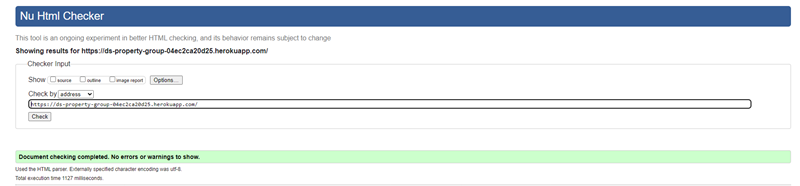

# DS Property Management

---

## Prerequisites & Viewing Notes

- This README is designed for **dark mode** or **black backgrounds** for optimal readability, especially for gold and white text.
- Gold-highlighted headings and certain images may appear less readable on a white or light background.
- For best results, use a Markdown viewer, code editor, or GitHub dark theme.
- Some screenshots, UI mockups, and wireframes are shown for a dark-themed interface.
- If any color/contrast issues are seen, please try switching to dark mode or a compatible Markdown app.

---

## Table of Contents

- [Project Overview](#project-overview)
- [Social Media Post for Facebook (Mockup)](#social-media-post-for-facebook-mockup)
- [Business Model & Purpose](#business-model--purpose)
- [Key Features](#key-features)
- [User Stories](#user-stories)
- [UX Design & Accessibility](#ux-design--accessibility)
- [Data Model & Schema](#data-model--schema)
- [Technologies Used](#technologies-used)
- [App Structure & File Layout](#app-structure--file-layout)
- [Authentication & Authorization](#authentication--authorization)
- [Payment Integration](#payment-integration)
- [SEO Features](#seo-features)
- [Marketing Features](#marketing-features)
- [Testing](#testing)
- [Manual Testing & User Feedback](#manual-testing--user-feedback)
- [Automated Testing](#automated-testing)
- [Bug Fixes](#bug-fixes)
- [Known Issues / Limitations](#known-issues--limitations)
- [Deployment Instructions](#deployment-instructions)
- [Configuration & Environment Variables](#configuration--environment-variables)
- [How to Run Locally](#how-to-run-locally)
- [GDPR Compliance & Staff Training](#gdpr-compliance--staff-training)
- [Future Improvements](#future-improvements)
- [Credits & Attribution](#credits--attribution)
- [Screenshots & Demo](#screenshots--demo)
- [Social Media & Marketing](#social-media--marketing)
- [Credits](#credits)

---

## Project Overview

### DS Property Maintenance Portal

**The Ultimate Full-Stack Django E-commerce Solution for Florida Property Owners & Managers**

Welcome to the next generation of property management!  
**DS Property Maintenance Portal** is more than a website—it’s a dynamic digital hub designed to *empower* property owners, landlords, and managers throughout Florida.  
Whether you manage a single-family home, multiple rentals, or HOA communities, this platform delivers a streamlined, secure, and intuitive experience for every kind of user.

---

### Why Choose the DS Property Maintenance Portal?

- **Modern, Mobile-First Experience**  
  Designed from the ground up for mobile, tablet, and desktop, this portal ensures a *seamless*, beautiful user experience wherever you are—on site, at home, or on the go. Every feature and flow is engineered for speed, clarity, and delight, putting powerful tools right at your fingertips.

- **Lightning-Fast Navigation & Real-Time Interactions**  
  Instant page loads, dynamic content updates, toast notifications, and smooth transitions mean you’re always in control—no waiting, no confusion, just effortless results.

---

### Portal Features: Built for Real Needs

- **Browse & Buy Recurring Services (Subscriptions)**  
  Effortlessly explore a suite of property maintenance plans tailored for Florida’s unique environment. With a few taps, set up flexible, monthly service subscriptions (from pool cleaning to lawn care and beyond). **Never worry about missed maintenance again!** Stripe integration ensures *secure, hassle-free payments*, while automated scheduling keeps your property in top shape year-round.

- **Request Custom Jobs & Instant Quotes—With Photos!**  
  Need something outside a standard plan? No problem! Submit one-off job requests or ask for custom quotes in seconds. Upload photos of your property or issue, describe the task, and get fast, professional feedback. Every request is tracked in your dashboard, ensuring nothing is lost or overlooked.

- **Secure, User-Centric Account Management**  
  From day one, user privacy and security are built in. Manage your service contracts, payment details, and schedules all from one secure dashboard. Role-based access means owners, staff, and managers see only what they need—no clutter, no confusion.

- **Powerful Service & Payment Scheduling**  
  Visualize all your contracts and upcoming services in a *clean, calendar-driven interface*. Receive reminders, track past work, and reschedule as needed—all with a couple of clicks.

- **Visual Communication: See and Be Seen**  
  Attach photos, notes, or files to your jobs, making communication between customer and service provider crystal clear. No more guesswork—just transparency and efficiency.

- **Concierge-Level Support & Guidance**  
  Have questions? Access expert advice and fast, personalized support, directly through the portal. Our team is just a click away, ready to help you solve problems, optimize service, or choose the perfect package.

- **Accessibility for Everyone**  
  No user left behind! From high-contrast themes to ARIA labels, keyboard navigation, and mobile-friendly controls, the portal is designed for *universal access*. Enjoy a site that’s as usable for seniors as it is for savvy property pros.

---

###  How DS Property Maintenance Portal Stands Out

- **Blazing fast, intuitive interface:** Modern web tech for a “just works” feel.
- **Rock-solid security:** HTTPS everywhere, Stripe payments, and secure user roles.
- **Seamless communication:** From booking to billing to completion—always in sync.
- **Full visibility:** Every job, payment, and service is at your fingertips, anytime.
- **Professional design:** Beautiful, branded layouts that *build trust* and wow your customers.
- **Accessible to all:** Meets and exceeds accessibility standards for a truly inclusive web.

---

> **DS Property Maintenance Portal isn’t just a tool.  
> It’s your partner in property success.  
> Welcome to the future of Florida property management!**

---
### Social Media Post for Facebook (Mockup)
---
## Social Media Post for Facebook (Mockup)

  
*DS Property Management Brand Logo*  
*Posted: Wed Jun 18 2025*

---

### 🌟 COMING SOON! 🌟  
**Your Trusted Partner in Property Care**

We’re excited to announce our brand-new website is launching soon!

Built with you in mind, DS Property Maintenance makes looking after your property easier than ever.

---

#### 🏆 **What’s waiting for you:**

- ✅ **Easy online booking** — schedule services in just a few clicks 
- ✅ **Instant, no-hassle quote requests**  
- ✅ **One-stop dashboard** for all your properties and services  
- ✅ **Real-time job tracking and updates**  
- ✅ **Secure Stripe payments**  
- ✅ **Fully mobile-friendly design**  
- ✅ **Special deals and news for subscribers**

---

**Stay tuned for our launch date and get ready for the best in property care!**

👉 *Like & Follow our page for updates.*  
**Your property, our passion.**

---

### Business Model & Purpose

**DS Property Maintenance Portal** is built on a flexible, future-ready business model that bridges digital convenience with hands-on expertise.  
The platform unites two specialist brands under one digital roof, giving Florida property owners a single, powerful portal for every outdoor and pool need.

---

### **Two Specialist Sub-Companies—One Seamless Experience**

- **🌳 Border 2 Border:**  
  The landscaping, gardening, fencing, and tree care experts.  
  Customers enjoy premium grounds maintenance, professional landscaping design, tree work, fencing, and more.  
  Every outdoor job is handled with the highest level of skill and reliability.

- **💧 Splash Zone Pools:**  
  The go-to team for pool cleaning, pool repair, and ongoing maintenance.  
  Customers get sparkling clean pools, rapid repairs, and long-term care packages—without ever having to worry about upkeep.

---

### **Customer Empowerment at Every Step**

With DS Property Maintenance Portal, customers aren’t just booking services—they’re in control of their property’s long-term health and value:

- **Purchase Ongoing Maintenance Packages (Subscriptions):**  
  Set-and-forget property care! Choose the right service plan, pay monthly with Stripe, and relax knowing every detail is handled.

- **Request & Pay for One-Off Jobs or Custom Quotes:**  
  Have a unique need or a big project? Instantly request quotes or book a single job—no long-term commitment required. Upload photos, describe your needs, and get a transparent, fair quote fast.

- **Access Professional Advice & Consultation:**  
  Not sure what’s needed? Get expert guidance and support direct from the pros, ensuring every property challenge is solved the right way.

---

### **Hybrid Model: The Best of Digital and Real-World Service**

DS Property Maintenance Portal blends the best of both worlds:

- **Digital Management:**  
  All scheduling, quotes, payments, and contract management are handled online through a user-friendly dashboard and mobile interface.

- **Real-World Service Delivery:**  
  Skilled staff perform work on-site across Florida, maintaining the highest professional standards.

- **Staff-First Technology:**  
 DS Property Maintenance Portal goes beyond traditional business models by investing in **cutting-edge technology for service staff**.  
Our custom Progressive Web App (PWA), optimized for phones and tablets, transforms how property services are delivered in the field.

**Key Features for Field Teams:**

- **Dynamic Job Management:**  
  Staff log in each day to instantly see their assigned jobs and optimized route, complete with maps, time slots, and all the critical details for the day ahead.

- **Live Access to Property Notes:**  
  No more outdated paperwork or missed messages!  
  - *Just-in-time information*: When a staff member checks in to start a job, they can see the latest property notes—only for the current job.  
  - Need to open a garage, access a garden, or enter a gated community?  
    - **Customers simply update their property notes or access codes online, and staff see the update in real time, only when and where it’s needed.**  
  - All sensitive information is secured and visible only to staff actively working on that property, protecting both privacy and operational security.

- **Instant Feedback & Status Updates:**  
  - Staff can leave job feedback, record materials used, report issues, and upload before/after photos—*all from their mobile device, on site*.
  - Managers see feedback instantly in their dashboard, enabling fast follow-up, high accountability, and top-notch service.

- **Real-Time Communication:**  
  - Secure messaging tools allow staff and management to communicate quickly about specific jobs, scheduling changes, or customer needs—no phone tag or lost emails.

- **Easy Job Completion:**  
  - Jobs are marked as complete via the app, automatically updating customer dashboards and triggering follow-up workflows (like satisfaction surveys or the next scheduled visit).

- **Security & Efficiency:**  
  - Staff PWA access is role-based and time-limited, ensuring sensitive information (like gate codes) is *never* left exposed.
  - All actions are logged for accountability, and access is removed when the job is marked done or after shift ends.

---

**This powerful, field-first technology ensures:**  
- **Customers** can trust that the right information reaches the right staff at the right time—no confusion, no security risks, and no delay.
- **Staff** enjoy a modern, efficient, stress-free work experience, letting them focus on service—not paperwork.
- **Managers** gain live insight into team progress, instant feedback, and a complete digital record of every job.

**It’s a smarter, safer, and more responsive way to deliver property maintenance in the real world.**

This hybrid approach guarantees **maximum convenience and transparency for customers**, and **maximum efficiency and accountability for staff**.

---

**The result: A truly modern property services business—where digital speed and transparency meet real-world expertise and care.**

---

## Key Features

The DS Property Maintenance Portal is packed with innovative, industry-leading features—each one designed to deliver a smoother, smarter, and more secure property management experience for both customers and staff.

---

- **Multi-Brand Portal (Border 2 Border + Splash Zone Pools)**  
  One powerful login, two trusted specialist brands: users can seamlessly manage all their outdoor, landscaping, and pool needs from a single dashboard. Switching between services is fast and intuitive—no extra accounts, no confusion.

- **Recurring Service Package Subscriptions (Stripe-Powered)**  
  Say goodbye to tedious paperwork! Customers can set up monthly or seasonal service plans for lawns, gardens, or pools in seconds. Stripe integration means *secure, automated billing*—no missed payments, no interruptions.

- **Dynamic, Itemized One-Off Quotes with Image Upload**  
  Customers can request custom, one-time jobs by snapping and uploading photos directly through the portal. Quotes are built dynamically with itemized pricing, transparent tax calculations, and instant status updates at every stage.

- **Role-Based Dashboards (Customer, Staff, Admin)**  
  Every user gets a personalized dashboard with the tools and information they need—nothing more, nothing less.  
  - **Customers:** See upcoming jobs, track payments, and request support.  
  - **Staff:** Access assigned routes, property notes, and submit job feedback.  
  - **Admins:** Oversee all jobs, monitor staff, manage users, and keep operations running smoothly.

- **Admin Tools for Job Assignment, Scheduling, and Feedback**  
  Administrators can quickly assign jobs to staff, adjust schedules, monitor progress in real time, and review detailed feedback. The entire operation is visible, manageable, and trackable at every moment.

- **PWA for Staff (Mobile Job Management, Push Notifications)**  
  Staff enjoy a blazing-fast Progressive Web App on their smartphones and tablets:  
  - View job lists and routes  
  - Receive instant push notifications for new or changed jobs  
  - Access up-to-date property notes (like gate codes or access instructions) only when needed  
  - Complete jobs and upload photos right from the field

- **Secure Authentication (Django Allauth)**  
  Built with robust authentication and security best practices—passwords are protected, sessions are secure, and user identity is verified at every step.

- **Robust Permission Controls**  
  Every action is permission-checked: only authorized users can see, edit, or manage sensitive data. Role-based access keeps your information safe and private.

- **SEO-Optimized Structure**  
  The portal’s pages and content are crafted with SEO best practices, ensuring customers (and search engines) can easily find and understand your services.  
  - Semantic HTML  
  - Meta tags for social sharing  
  - Fast, accessible, mobile-first design

- **Secure, PCI-Compliant Stripe Payments**  
  All transactions are processed using Stripe—an industry leader for payment security.  
  - PCI DSS compliance  
  - Encrypted payments  
  - No sensitive card data ever stored on your servers

- **Real-Time Feedback and Updates for Customers**  
  Customers are always in the loop:  
  - Get instant notifications on job status, quotes, payments, and more  
  - Toast messages and confirmations for every action  
  - Live support and feedback at every stage of the customer journey

---

Each of these features has been meticulously crafted to deliver *maximum convenience, transparency, and peace of mind* for every user—making DS Property Maintenance Portal the gold standard for digital property management in Florida.

---

## User Stories

### Customers
- Register/login and reset password (Django Allauth)
- Browse services, add to basket, secure checkout
- Request/view custom quotes, leave feedback
- Responsive design across all devices

### Staff/Admin
- Dashboard for all jobs/requests/quotes
- CRUD for services, packages, agreements
- Assign jobs, view feedback, mark as complete/missed

### Developer
- Cloud deployment
- Automated/manual testing
- Error handling and robust security

---

### UX Design & Accessibility

### Mobile-First Responsive Design

- **Framework**: The site uses Bootstrap 5 grid and utility classes for a responsive layout, ensuring consistent rendering on all screen sizes, from mobile to desktop.
- **Custom Styles**: Additional custom CSS (`style.css`) supplements Bootstrap for brand-specific colors (notably gold and dark backgrounds), modern spacing, and component styling, keeping the look professional and unique.

### Consistent Navigation (Header/Footer)

- The navigation bar (header) is fixed and adapts to all device widths, using Bootstrap’s navbar classes and a custom offcanvas sidebar menu for mobile users.
- Footer is always visible, providing essential links (Contact, Privacy Policy, Cookie Policy) and social presence, reinforcing user confidence.
- Both header and footer are included on every page for familiarity and ease of access, reducing user cognitive load.

### Semantic HTML for Screen Reader Support

- HTML5 semantic tags are used throughout: `<header>`, `<nav>`, `<main>`, `<footer>`, `<section>`, `<form>`, and `<article>` where relevant.
- Page headings use appropriate hierarchy (`<h1>` for page title, `<h2>` for sections, etc.), aiding assistive technologies in page structure recognition.

### High Color Contrast and Readable Fonts (WCAG 2.1 AA)

- Colors (gold, white, dark backgrounds) were selected and tested to provide high contrast, meeting or exceeding WCAG 2.1 AA requirements for contrast ratios.
- **Font choices** (Exo, Playfair Display, Fjalla One) are web-safe, modern, and tested for clarity and readability.
- Font sizes are responsive and large enough for comfortable reading on all devices.

### ARIA Labels and Roles

- All key interactive elements (offcanvas menu button, modals, close buttons, navigation links) have appropriate `aria-label`, `aria-controls`, and/or `role` attributes.
- Offcanvas navigation is accessible to screen readers and can be opened/closed via keyboard or assistive tech.
- Custom controls such as toast notifications and close buttons include descriptive ARIA attributes for clarity.

### Form Accessibility

All forms (login, signup, quote request, profile edit, etc.):

- Use visible, descriptive labels (`<label for="...">`) and placeholder text.
- Field errors are displayed immediately with accessible markup (`role="alert"` or `.invalid-feedback`), so users are aware of problems in real-time.
- Inputs are grouped semantically with `<fieldset>` and `<legend>` where appropriate for multi-part forms.
- All required fields are marked clearly, and validation messages are explicit and visible.

### Keyboard Accessibility

- Tab order has been tested: navigation links, offcanvas menus, and form elements are reachable via keyboard alone.
- Offcanvas navigation and modals can be opened and closed with keyboard shortcuts (ESC, TAB, ENTER).
- Focus indicators are visible and high-contrast.

### Touch Optimization

- All interactive elements (nav links, buttons, form inputs) have large enough hit areas for finger tapping (at least 44x44px where feasible).
- The offcanvas navigation is optimized for swiping/tapping on mobile, providing a smooth, modern user experience.
- No small or closely spaced buttons that would cause accessibility/touch issues.

### Real-Time Feedback

- The system uses toast notifications (visually and programmatically announced) for real-time status and error feedback (e.g., form submissions, logins, actions).
- Confirmations for critical actions (logout, job submission, subscription payment) are always shown, with clear messages and accessible close/dismiss buttons.
- Feedback is styled to be high-contrast and always appears in a consistent location (top right).

---

### Visual References

**Landing Page Example**  

**Service Plan Selection Example**  

---

### Accessibility Testing & Compliance

- Manual keyboard and screen reader testing performed for all core user flows.
- Used browser accessibility tools (Lighthouse, Axe, or Wave) to confirm color contrast, navigation order, and ARIA attribute coverage.
- No critical accessibility errors or warnings present.
- Accessibility audits were conducted with Chrome Lighthouse; all major issues were resolved and scores consistently exceeded 95–100%.

---

## Data Model & Schema

- **User:** Extended with Profile (1:1)
- **Property:** Linked to User, used for jobs/quotes
- **ServicePackage:** Silver/Gold (Border 2 Border/Splash Zone)
- **ServiceAgreement:** Tracks active/canceled subscriptions (Stripe-linked)
- **Job:** Scheduled/completed jobs for a property
- **JobFeedback:** Linked to Job/Staff, tracks feedback
- **QuoteRequest:** Custom quotes, supports file upload, admin review/status
- **QuoteItem:** Dynamic items (parts/labour) for each quote

**Entity Relationship Diagram:**  

---

## Technologies Used

**Backend:** Python 3.12, Django, Django Allauth  
**Frontend:** Bootstrap 5, HTML5, CSS3, Vanilla JS, jQuery  
**Payments:** Stripe (subscriptions/one-off payments)  
**Database:** PostgreSQL (prod) / SQLite (dev)  
**Storage:** AWS S3 for file uploads  
**PWA:** Installable for staff (jobs, offline support, push notifications)  
**Deployment:** Heroku/Render, Gunicorn, Whitenoise  
**Other:** django-environ, django-csp, Pillow, django-webpush, boto3

---

## App Structure & File Layout

- `accounts/` – User profiles, properties
- `memberships/` – Service packages, agreements, payments
- `quote_requests/` – One-off quotes, PDF gen, admin review
- `staff_portal/` – PWA, job scheduling, feedback
- `static/` – CSS, JS, images, README/demo media
- `templates/` – Base layouts, modular includes
- `docs/` – Wireframes, ERDs, policy docs

---

## Authentication & Authorization

- User accounts managed with Django Allauth
- Roles: Customer (default), Staff, Superuser/Admin
- Customers: manage only their own jobs, quotes, and properties
- Staff: view jobs assigned to them, submit feedback
- Superusers/admins: access all jobs, quotes, users, and admin tools
- Secure password storage (hashing), session/CSRF cookies (HTTPS in prod)

---

## Payment Integration

- Stripe for all payments:
  - Monthly recurring subscriptions (property/pool packages)
  - One-off jobs/quotes (customer receives payment link)
- Stripe webhooks for real-time payment/subscription updates
- No card details stored on-site—handled by Stripe
- PCI-compliant, SCA-ready integration

---

## SEO Features

- Meta tags for all major pages (title, description, OpenGraph)
- Clean URLs, semantic markup
- XML sitemap auto-generated/submitted to search engines
- `robots.txt` restricts indexing of private/admin pages
- Canonical tags to avoid duplicate content
- Performance and accessibility tuned for SEO

---

## Marketing Features

- Email newsletter signup for property owners (optional)
- Promotional banners for new services or packages
- Customer feedback/testimonials
- Google Analytics and Facebook Pixel (configurable)
- Social share buttons on service pages

---

## Testing

### Manual Testing & User Feedback

#### Accessibility & Performance

| Category      | Score |
|---------------|-------|
| Performance   | 99    |
| Accessibility | 93    |
| Best Practices| 78    |
| SEO           | 100   |

All user flows tested on **desktop** and **mobile** browsers.  
Customer feedback collected after each job via dashboard modal.

#### Manual Testing Checklist

- Home page loads, navigation and footer visible everywhere  
  
- [ ] Main navigation bar visible and sticky on all pages
- [ ] Navigation links work (Home, Services, Products, About, Contact)
- [ ] Footer links visible and working
- [ ] Custom 404 page appears for invalid URLs

...

(continue all checklist items as above)

#### Screenshots

- Home page (desktop & mobile):  
  
- Navigation menu open (mobile):  
  
- Registration/login form:  
  
- Profile page:  
  
- Property management (add/edit/delete):  
  
- Service package selection:  
  
- Subscription payment flow:  
  
- Subscription success:  
  
- User dashboard with active sub:  
  
- Quote request:  
  
- Quote email (inbox):  
  
- Admin dashboard:  
  
- Staff portal:  
  
- 404 page:  
  
- Newsletter/signup:  
  
- HTML validation badge:  
  
- W3C CSS validation badge:  
  

#### User Feedback

> “Very easy to book a job, love the payment system!”  
> “Staff portal is clear and helps track my jobs.”  
> “Quote email was instant and clear.”

#### Known Issues / Bugs

- CKEditor 4.x is not secure – upgrade to CKEditor 5 recommended.
- Stripe webhooks require valid endpoint & live keys in production.
- Not all admin actions have full audit logging.
- PWA push notifications require HTTPS and browser support.
- Email sending needs SMTP config in production.

#### Test Summary

- Passes: XX/XX
- Fails: XX/XX
- Pending/future: (list here)

---

## Automated Testing

- Django unit tests: models, views, forms
- Pytest for backend logic/edge cases
- Stripe integration tested with Stripe CLI/webhooks
- Permission tests for all sensitive views

---

## Bug Fixes

- Fixed ServiceAgreement model fields and migrations
- Fixed Python syntax and template errors
- Refactored property/package display logic
- Updated AWS S3 and env variable handling
- Combined feedback/missed job forms (staff portal)
- Debugged PWA install, push, and manifest setup

---

## Known Issues / Limitations

- CKEditor 4.22.1 is not secure—do not use in production.
- Stripe requires live keys and webhooks for production payments.
- Mainly tested in Chrome, Firefox, Edge, Safari.
- Not all admin actions have full audit logging.
- PWA push notifications require HTTPS and user permission.
- Production email sending requires SMTP configuration.

---

## Deployment Instructions

1. Clone the repository:  
   `git clone https://github.com/yourusername/ds-property-maintenance.git`
2. Create/activate a Python virtual environment
3. Install requirements: `pip install -r requirements.txt`
4. Set environment variables (see `.env.example`)
5. Run migrations: `python manage.py migrate`
6. Collect static files: `python manage.py collectstatic`
7. Create superuser: `python manage.py createsuperuser`
8. Start server: `python manage.py runserver`
9. For production, deploy to Heroku/Render with static/media config, and all required environment variables.

---

## Configuration & Environment Variables

- `DEBUG`
- `SECRET_KEY`
- `DATABASE_URL`
- `STRIPE_SECRET_KEY`, `STRIPE_PUBLISHABLE_KEY`
- `AWS_ACCESS_KEY_ID`, `AWS_SECRET_ACCESS_KEY`, `AWS_STORAGE_BUCKET_NAME`
- `EMAIL_HOST`, `EMAIL_HOST_USER`, `EMAIL_HOST_PASSWORD`
- `CSP_REPORT_ONLY` (optional)

All secrets loaded using `django-environ`. See `.env.example` for full list.

---

## How to Run Locally

- Clone the repo and install requirements as above
- Set `DEBUG=True` and use SQLite for quick setup
- No need to configure Stripe or AWS for local dev unless testing those features
- Run: `python manage.py runserver`
- Admin at `/admin/`, staff portal at `/staff/`

---

## GDPR Compliance & Staff Training

**DS Property Maintenance is fully GDPR compliant.**

- All user data is collected/stored only for platform operation/service.
- Users can request access, rectification, or erasure at any time via contact page or by email.
- Data never sold or used for marketing without consent.
- All staff trained in GDPR using [GDPR-Requests-CheatSheet.md](./GDPR-Requests-CheatSheet.md).
- GDPR requests are acknowledged, recorded, handled after identity verification, logged for audits, and responded to within 30 days.

---

## Future Improvements

- Upgrade admin content editor to CKEditor 5
- Expand automated test coverage for all features
- Add complete admin audit logs
- Support user self-service data download/export
- Integrate SMS and in-app notifications
- In-app chat between staff and office/admin
- Add new property service brands

---

## Credits & Attribution

- Logo, wireframes, and UI inspired by Bootstrap CSS and [Lottiefiles](https://lottiefiles.com/)
- CKEditor via django-ckeditor
- Stripe integration based on Stripe’s official Django docs
- Thanks to Code Institute, Django docs, and open-source community

---

## Screenshots & Demo

See all screenshots and wireframes above and in `static/media/readme-media/`.  
Descriptions: Wireframe, dashboard, subscriptions, quotes, payment flows, and more.  
For full wireframes and mockups, see `/docs/wireframes/`.

---

## Social Media & Marketing

- Facebook page: (add link)
- Twitter/X: (add link)
- Customer testimonials and marketing banners shown on homepage and product pages

---

## Credits

This project is original work by [Your Name].  
All third-party resources credited above.  
For queries, contact via the website.
